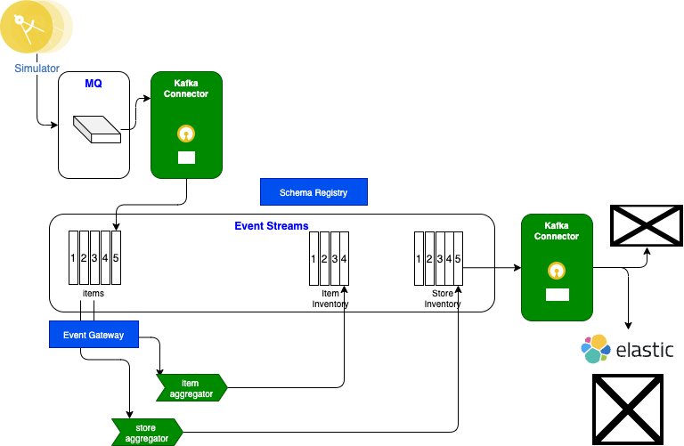
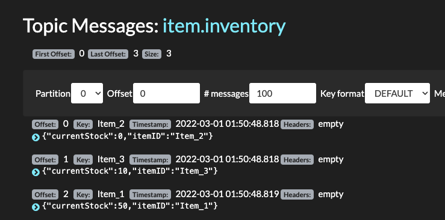
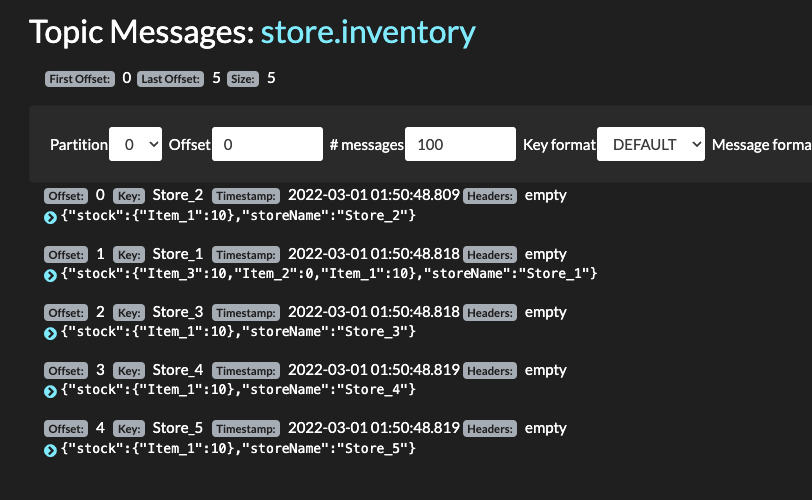
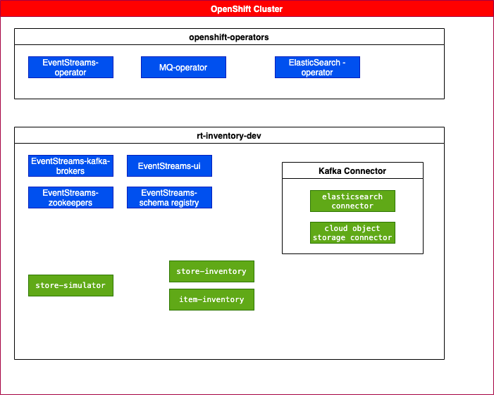
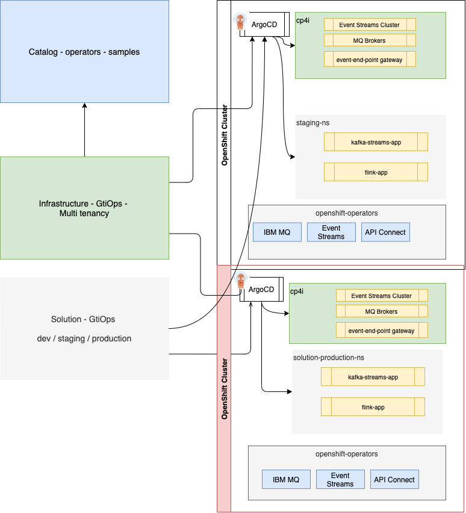

# Real time inventory demo GitOps

This repository uses OpenShift GitOps to manage the deployment of the real-time inventory solution. The GitOps approach is an adaptation of [Red Hat's KAM practices](https://developers.redhat.com/articles/2021/07/21/bootstrap-gitops-red-hat-openshift-pipelines-and-kam-cli#a_gitops_approach_to_application_deployment) enhanced
with boostraping some important operators deployments like the OpenShift GitOps Operator and OpenShift Pipelines Operator installation if not done yet.

## What is covered

This GitOps supports bootstrapping the solution as a Day 1 operation, with the deployment of operators, secrets, pipelines... and then Day 2 operations, as once the solution is deployed, all changes to the configurations are done in this repository and propagated by ArgoCD to the runtime cluster.

In this Gitops you can do different approaches to deploy the real-time inventory solution:

* [Start from an OpenShift Cluster without any Cloud Pak for Integration components](#gitops-from-openshift-cluster)
* [Start from a Cloud Pak for integration deployed in cp4i project](#gitops-from-cp4i-deployment)
* [Run locally with docker](#run-the-solution-locally)

## Real-time inventory scenario presentation

This scenario implements a simple real-time inventory management solution based on some real life MVPs we developed in 2020. 
For a full explanation of the use case and scenario demo go to [this chapter](https://ibm-cloud-architecture.github.io/refarch-eda/scenarios/realtime-inventory/#use-case-overview) in EDA reference architecture.

Stores are sending their sale transactions to a central messaging platform, based on IBM MQ queues and Kafka topics.

As illustrated by the following figure, we are using Kafka / Event Streams to support the events pub/sub and 
the need to have aggregators to compute store inventory and item cross stores inventory. The following figure illustrates the expected
components deployed by this GitOps:




* The store simulator injects directly sell or restock events to Kafka to the `items` topic
* The store simulator can also generate messages to IBM MQ using JMS API or to RabbitMQ using AMQP protocol
* When messages are sourced to Queues, then a Kafka Source Connector is used to propagate message to `items` topics.
* The Item-aggregator component computes items inventory cross stores, so aggregate at the item_ID level. 
* The Store-aggregator computes aggregate at the store level for each items.


## Two different streaming approaches

We propose two approaches to develop the streaming processing. 

* One using Kafka Streams 
* One using Apache Flink

### Kafka Streams implementation

We have transformed this implementation into a lab that can be read [here](https://ibm-cloud-architecture.github.io/refarch-eda/scenarios/realtime-inventory/)

* The Item-aggregator, based on Kafka Stream APIs, is in this project: [refarch-eda-store-inventory](https://github.com/ibm-cloud-architecture/refarch-eda-store-inventory)
* The Store-aggregator, also based on Kafka Stream APIs, is in this project: [refarch-eda-store-inventory](https://github.com/ibm-cloud-architecture/refarch-eda-store-inventory)

### Fink implementation

See [the refarch-eda-item-inventory-sql-flink repository](https://github.com/ibm-cloud-architecture/refarch-eda-item-inventory-sql-flink) for more information.

## Run the solution locally

### Run the Kafka Stream implementation

The Kafka connector image and each service docker images are in the `quay.io/ibmcase` image registry.

* Start local kafka, with the 3 apps, MQ and ElasticSearch services run

```sh
cd local-demo/kstreams
docker-compose -f docker-compose-all.yaml up -d
```

* As an alternate to only start Kafka, MQ and the 3 apps run:

```sh
cd local-demo/kstreams
docker-compose up -d
```

* As another alternate without MQ and elastic search:

```sh
cd local-demo/kstreams
docker-compose -f docker-compose-kafka.yaml up -d
```

* Execute the demonstration using the script as defined in: [refarch-eda/scenarios/realtime-inventory](https://ibm-cloud-architecture.github.io/refarch-eda/scenarios/realtime-inventory/#demonstration-script-for-the-solution)

Use the simulator the console is: [http://localhost:8080/#/](http://localhost:8080/).

If you run the controlled scenario the data are:

| Store | Item | Action |
| --- | --- | --- |
| Store 1 | Item_1 | +10 |
| Store 1 | Item_2 | +5 |
| Store 1 | Item_3 | +15 |
| Store 2 | Item_1 | +10 |
| Store 3 | Item_1 | +10 |
| Store 4 | Item_1 | +10 |
| Store 5 | Item_1 | +10 |
| Store 1 | Item_2 | -5 |
| Store 1 | Item_3 | -5 |
       
Inventory should be at the store level: `{"stock":{"Item_3":10,"Item_2":0,"Item_1":10},"storeName":"Store_1"}` and at the item level:

| Item | Stock |
| --- | --- |
| Item_1 | 50 |
| Item_2 | 0 |
| Item_3 | 10 |


The store inventory API is at [http://localhost:8082](http://localhost:8082/q/swagger-ui)

The item inventory API is at [http://localhost:8081](http://localhost:8081/q/swagger-ui)

Kafdrop UI to see messages in `items`, `store.inventory` and `item.inventory` topics is at [http://localhost:9000](http://localhost:9000)

* Verify Events are in `items` topic using Kafdrop:

  

* Verify item inventory events are in `item-inventory`

  

* Finally verify item inventory events are in `store-inventory`

  

* If using ElasticSearch go to Kibana UI at []()

* Stop the demo

```sh
docker-compose -f docker-compose-all.yaml down
# OR
docker-compose  down
# OR
docker-compose -f docker-compose-kafka.yaml down
```

### Run the Flink implementation

To be done.

## GitOps presentation

### How this repository was created

We used KAM CLI to create the project with the following parameters:

Get Github access token, to be used in the KAM bootstrap command, in future steps.


```sh
kam bootstrap \
--service-repo-url https://github.com/ibm-cloud-architecture/refarch-eda-store-inventory \
--gitops-repo-url  https://github.com/ibm-cloud-architecture/eda-rt-inventory-gitops \
--image-repo image-registry.openshift-image-registry.svc:5000/ibmcase/ \
--output eda-rt-inventory-gitops \
--git-host-access-token <a-github-token> \
--prefix edademo --push-to-git=true
```

### What was added

* Added a bootstrap folder to define gitops and Cloud Pak for integration capabilities operator declarations and to create an ArgoCD project
* Defined a script to install IBM Catalogs and Cloud Pak for Integration components 
* Added scripts to deploy the gitops, pipelines operators using Makefile.

## GitOps from a new OpenShift Cluster

The GitOps approach is using the [catalog repository](https://github.com/ibm-cloud-architecture/eda-gitops-catalog) to keep product-specific operator subscription definitions, where product instance definitions are part of this [real-time inventory solution GitOps](https://github.com/ibm-cloud-architecture/eda-rt-inventory-gitops) repository. This corresponds to the yellow rectangles in the figure below:


### What is deployed

The development project includes event-streams, MQ, schema registry... 

  

Part of this deployment will be based on commands run from your laptop, part as pipelines, and part as ArgoCD apps. The approach is based on the following:

* secrets, and operators deployments to bootstrap the CI/CD are configured with Makefile and commands. Operators are deployed in `openshift-operators`.
* Tekton pipelines are used to deploy some CP4I operators
* ArgoCD apps are used to deploy CP4I operands: the use of ArgoCD for this, is justified for Day 2 operations. 

The pipelines are using a service account, named `pipeline`, in the `rt-inventory-cicd` project, and cluster role to access different resources cross namespaces.

*For a pure demo, without any ArgoCD, other pipelines and Make commands are available to deploy operators and operands, see section [Deploy without ArgoCD apps](#deploy-without-argocd-apps)*

### CP4Integration installation considerations

* In this solution, CP4I operators are deployed in **All namespaces**, the entire OpenShift cluster effectively behaves as one large tenant.
* With **All namespace** there can be only one Platform Navigator installed per cluster, and all Cloud Pak instances are owned by that Platform Navigator. 
* A single instance of IBM Cloud Pak foundational services is installed in the `ibm-common-services` namespace if the foundational services operator is not already installed on the cluster.
* Operators can be upgraded automatically when new compatible versions are available. For production deployment, the manual upgrade may be desirable.

### Bootstrap GitOps

* Login to the OpenShift Console, and get login token to be able to use `oc cli`
* Obtain your [IBM license entitlement key](https://github.com/IBM/cloudpak-gitops/blob/main/docs/install.md#obtain-an-entitlement-key) and export as KEY environment variables

    ```sh
    export KEY=<yourentitlementkey>
    ```
* create YAML files for git secret based on template
- `github-credentials.yaml`
    - based on [`template-github-credentials.yaml`](./template-github-credentials.yaml) - github personal access token with access to clone this repo - which should be created in the namespace where the pipelines will run

* If not done already, use the following command to install GitOps and Pipeline operators, entitlement key, ibm catalog: 

  ```sh
   make prepare
  ```
    
  Once the operators are running the command: `oc get pods -n openshift-gitops` should return
a list of pods like:

  ```sh
    NAME                                                          READY   STATUS    RESTARTS   AGE
    openshift-gitops-application-controller-0                     1/1     Running   0          4h5m
    openshift-gitops-applicationset-controller-6948bcf87c-jdv2x   1/1     Running   0          4h5m
    openshift-gitops-dex-server-64cbd8d7bd-76czz                  1/1     Running   0          4h5m
    openshift-gitops-redis-7867d74fb4-dssr2                       1/1     Running   0          4h5m
    openshift-gitops-repo-server-6dc777c845-gdjhr                 1/1     Running   0          4h5m
    openshift-gitops-server-7957cc47d9-cmxvw                      1/1     Running   0          4h5m
  ```


* Deploy IBM product Operators (Event Streams, MQ...) to monitor All Namespaces 


  ```sh
  make install_cp4i_operators
  ```
 
* Get the ArgoCD User Interface URL and open a web browser

   ```sh
   chrome https://$(oc get route openshift-gitops-server -o jsonpath='{.status.ingress[].host}'  -n openshift-gitops)
   ```

### Deploy ArgoCD app of apps:

* To start the Continuous Deployment with ArgoCD, just executing the following command should deploy event streams cluster instance, MQ broker, kafka connect, and the different microservices.

   ```sh
   oc apply -k config/argocd
   ```

The expected set of ArgoCD apps looks like:

  

  * **rt-inventory-Argo-app** is an app of apps
  * **rt-inventory-dev-env** is for the rt-inventory-dev namespace
  * **rt-inventory-dev-services** is for event streams, kafka connect cluster and mq deployments in dev-env namespace
  * **rt-inventory-store-simulator-app** is for the simulator app used in the demo.
  * **rt-inventory-item-inventory** for the item aggregator application
  * **rt-inventory-store-inventory** for the store aggregator application

### Potential errors

????- "ConfigMap ibm-common-services-status in **kube-public** to be ready"
  * While the Event Streams cluster is created: An unexpected exception was encountered: Exceeded timeout of 1200000ms while waiting for ConfigMap resource **ibm-common-services-status** in namespace **kube-public** to be ready. More detail can be found in the Event Streams Operator log.
  * This is an issue known as of 10.5.  Restart the ES operator pod
  * See also https://github.ibm.com/mhub/qp-planning/issues/7383

### Configure connector

* Go to the dev project: `oc project rt-inventory-dev`
* Deploy the sink kafka connector for cloud object storage:

  * Modify the file `kafka-cos-sink-connector.yaml` in `environments/rt-inventory-dev/services/kconnect`, by replacing the following line from the cloud object storage credentials:

  ```yaml
    cos.api.key: IBM_COS_API_KEY
    cos.bucket.location: IBM_COS_BUCKET_LOCATION
    cos.bucket.name: IBM_COS_BUCKET_NAME
    cos.bucket.resiliency: IBM_COS_RESILIENCY
    cos.service.crn: "IBM_COS_CRM"
  ```

  * Then deploy the connector: `oc apply -f environments/rt-inventory-dev/services/kconnect/kafka-cos-sink-connector.yaml `

* Deploy the MQ source connector

  ```sh
  oc apply -f environments/rt-inventory-dev/services/kconnect/mq-source.json
  ```

* Access to the Simulator User Interface via:

   ```sh
   chrome http://$(oc get route store-simulator -o jsonpath='{.status.ingress[].host}')
   ```

* Access Event Stream Console:

  ```sh
  chrome https://$(oc get route dev-ibm-es-ui -o jsonpath='{.status.ingress[].host}')
  ```

* Access to IBM MQ Admin Console

  ```sh
  chrome https://$(oc get route store-mq-ibm-mq-qm -o jsonpath='{.status.ingress[].host}')
  ```

## Deploy without ArgoCD apps

TBD 

## GitOps from CP4I deployment

In this section we suppose CP4I is already deployed in a unique `cp4i` namespace. So somewhere someone has already deployed the infrastructure, to deploy the components as multi tenants. (This is represented as the green rectangles in the figure below)



So the focus is on the solution component deployment.

### Bootstrap GitOps

* Login to the OpenShift Console, and get login token to be able to use `oc cli`
* If not done already, use the script to install GitOps and Pipeline operators: 

  ```sh
    ./bootstrap/scripts/installGitOpsOperators.sh
  ```
    
  Once the operators are running the command: `oc get pods -n openshift-gitops` should return
a list of pods like:

  ```sh
    NAME                                                          READY   STATUS    RESTARTS   AGE
    openshift-gitops-application-controller-0                     1/1     Running   0          4h5m
    openshift-gitops-applicationset-controller-6948bcf87c-jdv2x   1/1     Running   0          4h5m
    openshift-gitops-dex-server-64cbd8d7bd-76czz                  1/1     Running   0          4h5m
    openshift-gitops-redis-7867d74fb4-dssr2                       1/1     Running   0          4h5m
    openshift-gitops-repo-server-6dc777c845-gdjhr                 1/1     Running   0          4h5m
    openshift-gitops-server-7957cc47d9-cmxvw                      1/1     Running   0          4h5m
  ```

* Create an ArgoCD project named `rt-inventory`

   ```sh
   oc apply -k bootstrap/argocd-project
   # Result
   appproject.argoproj.io/rt-inventory created
   ```

* To get the `admin` user's password use the command

    ```sh
    oc extract secret/openshift-gitops-cluster -n openshift-gitops --to=-
    ```

* Get the ArgoCD User Interface URL and open a web browser

   ```sh
   chrome https://$(oc get route openshift-gitops-server -o jsonpath='{.status.ingress[].host}'  -n openshift-gitops)
   ```

### Deploy the solution

* To start the Continuous Deployment with ArgoCD, just executing the following command should deploy different microservices under rt-inventory-dev project using event-streams, MQ.. from another project (e.g. cp4i).

   ```sh
   oc apply -k config/cp4i-deploy
   ```

