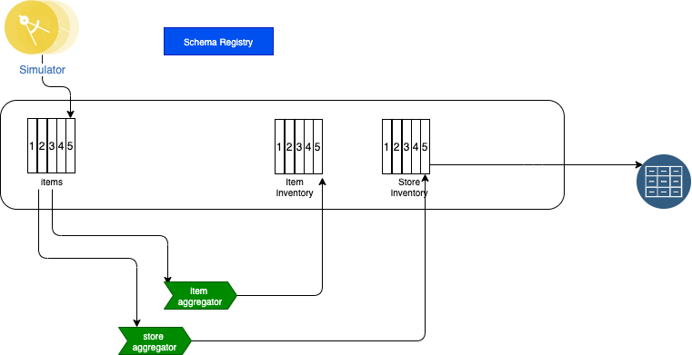

# Real time inventory demo GitOps

This repository uses OpenShift GitOps to manage the deployment of the real-time inventory solution.

## Scenario presentation

This scenario implements a simple real-time inventory management solution based on some real life MVPs we developed in 2020. 

Stores are sending their sale transactions to a central messaging platform, based on queues or Kafka topics.

As illustrated by the following figure, we are using Kafka / Event Streams to support the events pub/sub and 
the need to have aggregators to compute store inventory and item cross stores inventory. The following figure illustrates the expected
components:




* The store simulator injects directly sell events to Kafka to the `items` topic
* The store simulator can also generate messages to IBM MQ using JMS API or to RabbitMQ using AMQP protocol
* When messages are sourced to Queues, then a Kafka Source Connector is used to propagate message to `items` topics.
* The Item-aggregator component computes items inventory cross stores, so aggregate at the item_ID level. 
* The Store-aggregator computes aggregate at the store level for each items.

### Two different streaming approaches

We propose two approaches to develop the streaming processing. 

* One using Kafka Streams 
* One using Apache Flink

#### Kafka Streams implementation

We have transformed this implementation into a lab that can be read [here](https://ibm-cloud-architecture.github.io/refarch-eda/scenarios/realtime-inventory/)

* The Item-aggregator is in this project: [refarch-eda-store-inventory](https://github.com/ibm-cloud-architecture/refarch-eda-store-inventory)
* The Store-aggregator is in this project: [refarch-eda-store-inventory](https://github.com/ibm-cloud-architecture/refarch-eda-store-inventory)

## Run the solution locally

### Run the Kafka Stream implementation

Each service docker images are in the `quay.io/ibmcase` image registry.

* Start local kafka and services

```sh
cd local-demo/kstreams
docker compose up -d
```

* Create topics

```sh
# under local-demo/kstreams
./createTopics.sh
```

* Execute the demonstration using the script in :[refarch-eda/scenarios/realtime-inventory](https://ibm-cloud-architecture.github.io/refarch-eda/scenarios/realtime-inventory/#demonstration-script-for-the-solution)

Then for the simulator the console is: [http://localhost:8080/#/](http://localhost:8080/), and
follow the demo script defined in [this article](https://ibm-cloud-architecture.github.io/refarch-eda/scenarios/realtime-inventory/#demonstration-script-for-the-solution).

If you run the controlled scenario the data are:

| Store | Item | Action |
| --- | --- | --- |
| Store 1 | Item_1 | +10 |
| Store 1 | Item_2 | +5 |
| Store 1 | Item_3 | +15 |
| Store 2 | Item_1 | +10 |
| Store 3 | Item_1 | +10 |
| Store 4 | Item_1 | +10 |
| Store 5 | Item_1 | +10 |
| Store 1 | Item_2 | -5 |
| Store 1 | Item_3 | -5 |
       
Inventory should be at the store level: `{"stock":{"Item_3":10,"Item_2":0,"Item_1":10},"storeName":"Store_1"}` and at the item level:

| Item | Stock |
| --- | --- |
| Item_1 | 50 |
| Item_2 | 0 |
| Item_3 | 10 |


The store inventory API is at [http://localhost:8082](http://localhost:8082/q/swagger-ui)

The item inventory API is at [http://localhost:8081](http://localhost:8081/q/swagger-ui)

Kafdrop UI to see messages in `items`, `store.inventory` and `item.inventory` topics is at [http://localhost:9000](http://localhost:9000)

* Stop the demo

```sh
docker-compose down
```

### Run the Flink implementation

To be done.

## GitOps 

### How this repository was created

We used KAM CLI to create the project with the following parameters:

Get Github access token, to be used in the KAM bootstrap command, in future steps.


```sh
kam bootstrap \
--service-repo-url https://github.com/ibm-cloud-architecture/refarch-eda-store-inventory \
--gitops-repo-url  https://github.com/ibm-cloud-architecture/eda-rt-inventory-gitops \
--image-repo image-registry.openshift-image-registry.svc:5000/ibmcase/ \
--output eda-rt-inventory-gitops \
--git-host-access-token <a-github-token> \
--prefix edademo --push-to-git=true
```

### What was added

* Added a bootstrap folder to define gitops and operator declaration and to create an ArgoCD project
* Defined a script to install IBM Catalogs and Cloud Pak for Integration components 
* Added scripts to deploy the gitops, pipelines operators: `scripts/installOperators.sh`

### What is deployed

  

### Bootstrap

* Login to the OpenShift Console, and get login token to be able to use `oc cli`
* If not done already, use the script to install GitOps and Pipeline operators: 

  ```sh
    ./bootstrap/scripts/installGitOpsOperators.sh
  ```
    
  Once the operators are running the command: `oc get pods -n openshift-gitops` should return
a list of pods like:

  ```sh
    NAME                                                          READY   STATUS    RESTARTS   AGE
    openshift-gitops-application-controller-0                     1/1     Running   0          4h5m
    openshift-gitops-applicationset-controller-6948bcf87c-jdv2x   1/1     Running   0          4h5m
    openshift-gitops-dex-server-64cbd8d7bd-76czz                  1/1     Running   0          4h5m
    openshift-gitops-redis-7867d74fb4-dssr2                       1/1     Running   0          4h5m
    openshift-gitops-repo-server-6dc777c845-gdjhr                 1/1     Running   0          4h5m
    openshift-gitops-server-7957cc47d9-cmxvw                      1/1     Running   0          4h5m
  ```

* If not done already, install IBM product catalog

  ```sh
  ./bootstrap/scripts/installIBMCatalog.sh
  ```

* Obtain your [IBM license entitlement key](https://github.com/IBM/cloudpak-gitops/blob/main/docs/install.md#obtain-an-entitlement-key)
* Update the [OCP global pull secret of the `openshift-operators` project](https://github.com/IBM/cloudpak-gitops/blob/main/docs/install.md#update-the-ocp-global-pull-secret)
with the entitlement key

    ```sh
    export KEY=<yourentitlementkey>
    oc create secret docker-registry ibm-entitlement-key \
    --docker-username=cp \
    --docker-server=cp.icr.io \
    --namespace=openshift-operators \
    --docker-password=$KEY 
    ```

* Deploy IBM product Operators  to monitor All Namespaces 


  ```sh
  ./bootstrap/scripts/installIBMOperators.sh
  ```
 
* Create ArgoCD project named `rt-inventory`

   ```sh
   oc apply -k bootstrap/argocd-project
   ```

* To get the `admin` user's password use the command

    ```sh
    oc extract secret/openshift-gitops-cluster -n openshift-gitops --to=-
    ```

* Get the ArgoCD User Interface URL and open a web browser

   ```sh
   chrome https://$(oc get route openshift-gitops-server -o jsonpath='{.status.ingress[].host}'  -n openshift-gitops)
   ```


* To start the CD management with ArgoCD, just executing the following should work.

   ```sh
   oc apply -k config/argocd
   ```

The expected set of ArgoCD apps looks like:

  

  * Argo-app is an app of apps
  * dev-env is for the rt-inventory-dev namespace
  * dev-services is for event streams and mq deployment in dev-env namespace
  * store-simulator-app is for the simulator app used in the demo.
  * item-inventory for the item aggregator application
  * store-inventory for the store aggregator application

* Go to the dev project: `oc project rt-inventory-dev`
* Deploy the sink kafka connector for cloud object storage:

  * Modify the file `kafka-cos-sink-connector.yaml` in `environments/rt-inventory-dev/services/kconnect`, by replacing the following line from the cloud object storage credentials:

  ```yaml
    cos.api.key: IBM_COS_API_KEY
    cos.bucket.location: IBM_COS_BUCKET_LOCATION
    cos.bucket.name: IBM_COS_BUCKET_NAME
    cos.bucket.resiliency: IBM_COS_RESILIENCY
    cos.service.crn: "IBM_COS_CRM"
  ```

  * Then deploy the connector: `oc apply -f jb-kafka-cos-sink-connector.yaml `
  
* Access to the Simulator User Interface via:

   ```sh
   chrome http://$(oc get route store-simulator -o jsonpath='{.status.ingress[].host}')
   ```

* Access Event Stream Console:

  ```sh
  chrome https://$(oc get route dev-ibm-es-ui -o jsonpath='{.status.ingress[].host}')
  ```