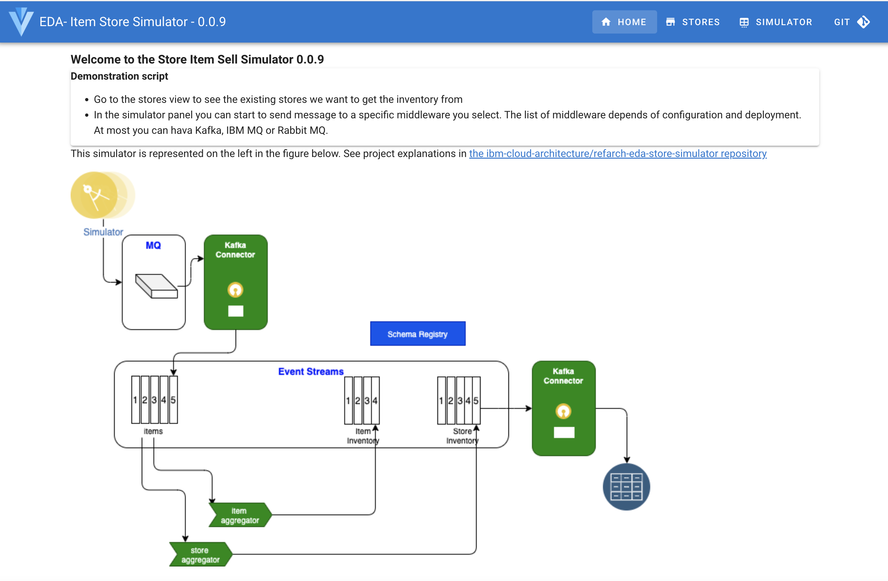
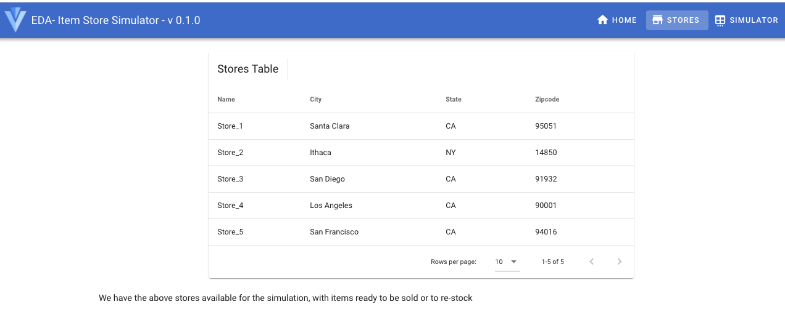
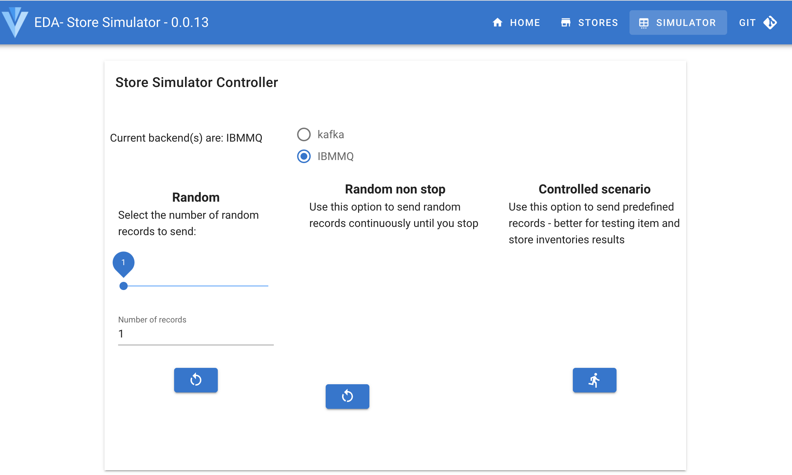
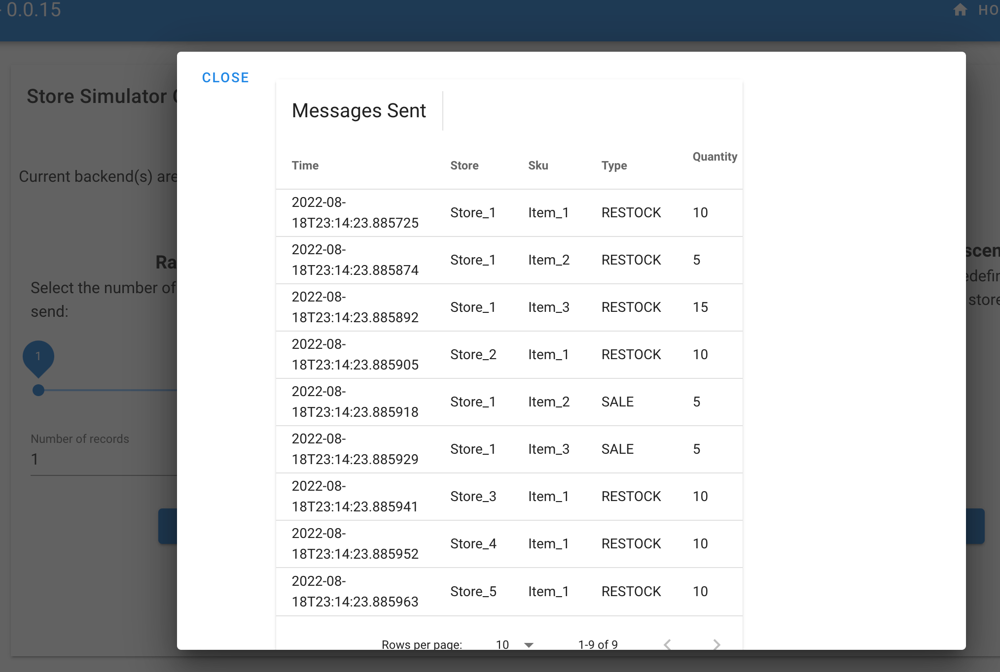
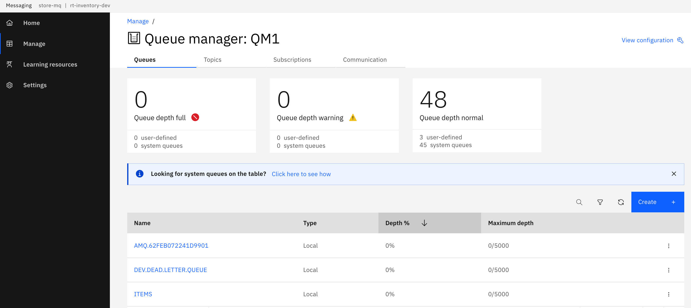
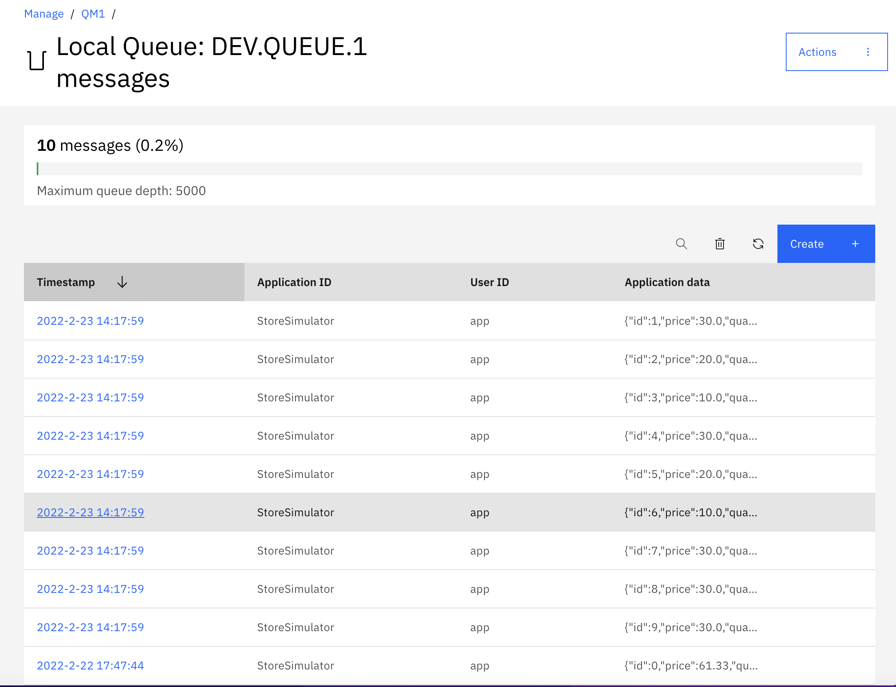
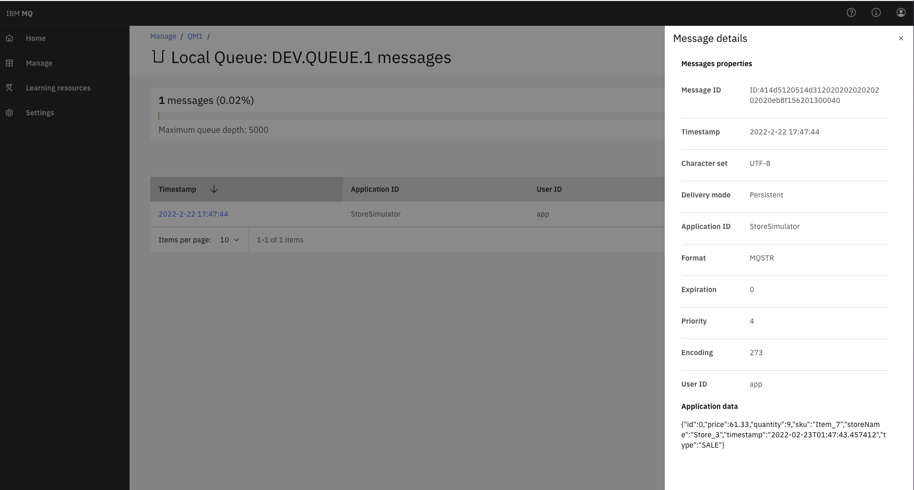
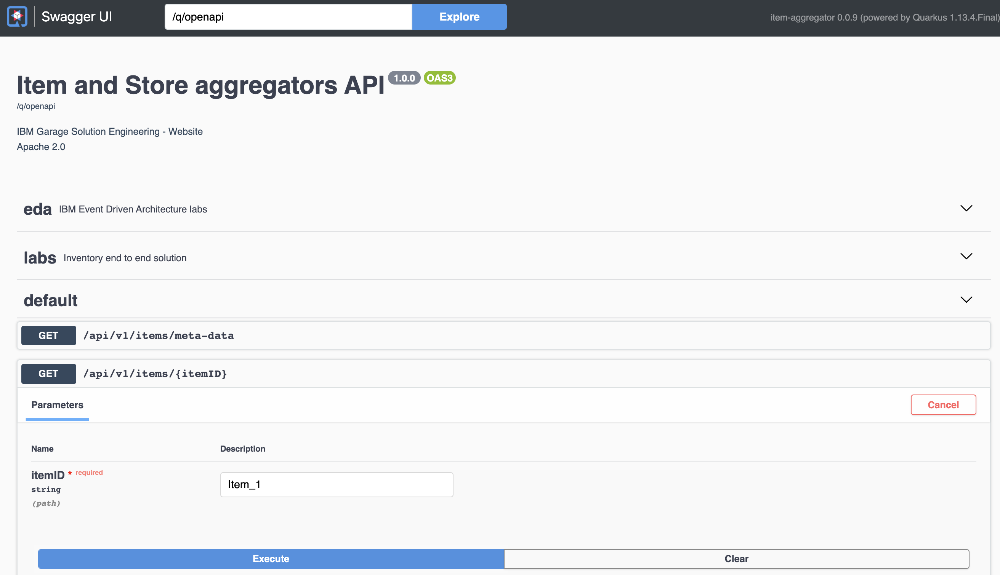
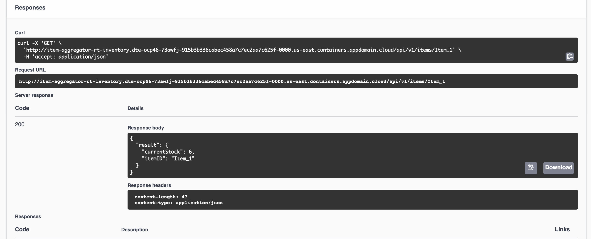
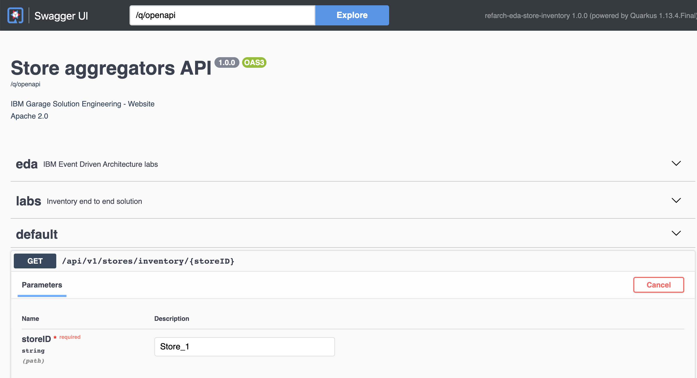

# How to demonstrate the real time inventory scenario

## Real-time inventory scenario presentation

Stores are sending their sale transactions to a central messaging platform, based on IBM MQ queues and Kafka topics.

As illustrated by the following figure, we are using Kafka / Event Streams to support the events pub/sub and 
the need to have aggregators to compute store inventory and item cross stores inventory. The following figure illustrates the expected
components deployed by this GitOps:


* The store simulator send sell or restock messages to MQ ITEMS queue, which are picked up by Kafka source connector to publish to kafka `items` topic. 
* The store simulator send directly to Kafka to the `items` topic
* The Item-aggregator component computes items inventory cross stores, so aggregate at the item_ID level. 
* The Store-aggregator computes aggregate at the store level for each items.
* Sink connector can write to Cloud Object Storage buckets
* Sink connector can write to Elastic Search

## Demonstration script

1. Get the Store simulator route using the following command and start a Web Browser

  ```sh
  chrome $(oc get routes store-simulator  -o jsonpath="{.spec.host}")
  ```

  You should reach the Home page of the simulator

  

1. Look at existing stores, using the top right `STORES` menu. This is just for viewing the data. 

  

1. Go to the SIMULATOR menu, and start the controlled scenario which will send predefined records:

  

  Here is the ordered list of messages sent:

  | Store | Item | Action |
  | --- | --- | --- |
  | Store 1 | Item_1 | +10 |
  | Store 1 | Item_2 | +5 |
  | Store 1 | Item_3 | +15 |
  | Store 2 | Item_1 | +10 |
  | Store 3 | Item_1 | +10 |
  | Store 4 | Item_1 | +10 |
  | Store 5 | Item_1 | +10 |
  | Store 1 | Item_2 | -5 |
  | Store 1 | Item_3 | -5 |


  once started a table should be displayed to present the records sent to Kafka. (The UI needs some enhancement ;-)

   

1. Verify messages are in queue:

   * Access the MQ Console admin: 

  ```
  chrome http://$(oc get routes store-mq-ibm-mq-web  -o jsonpath="{.spec.host}")
  ```

  * Go to the the Queue manager admin console and select the QM1 Queue manager 

  

  * Select the ITEMS queue to verify the messages reach the queue. It may be possible that the Kafka Connector already consumed those messages
  so the queue may look empty.

  

  Below is a view of one of those message.

  


1. Let assess if we can see the item stock cross stores: using the `item-aggregator` route, something like ` item-aggregator-rt-inventory.dte-ocp46-73awfj-915b3b336cabec458a7c7ec2aa7c625f-0000.us-east.containers.appdomain.cloud ` but completed with '/q/swagger-ui' as we want to access the API
  
  To get this route use the following command:

  ```sh
  chrome http://$(oc get routes item-inventory -o jsonpath="{.spec.host}")
  ```

   Select the get `/api/v1/items/{itemID}` operation:

  

  Use one of the following item id: [Item_1, Item_2, Item_3, Item_4, Item_5, Item_6, Item_7]. You should get 
  the current stock cross stores

  

1. Let assess a store stock, for that we access the store aggregator URL: `store-aggregator-rt-inventory.dte-ocp46-73awfj-915b3b336cabec458a7c7ec2aa7c625f-0000.us-east.containers.appdomain.cloud ` with the `/q/swagger-ui` suffix.

  To get this route use the following command:

  ```sh
  chrome http://$(oc get routes store-aggregator -o jsonpath="{.spec.host}")
  ```

  Then using the GET on the `api/v1/stores/inventory/{storeID}`, and enter one of the available store: `[Store_1, Store_2, Store_3, Store_4, Store_5]`

  

  The response should look like:

  
