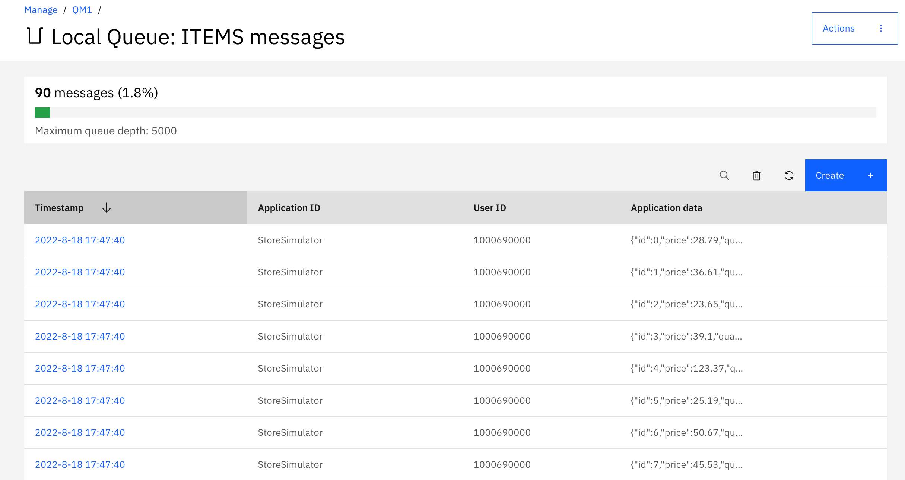
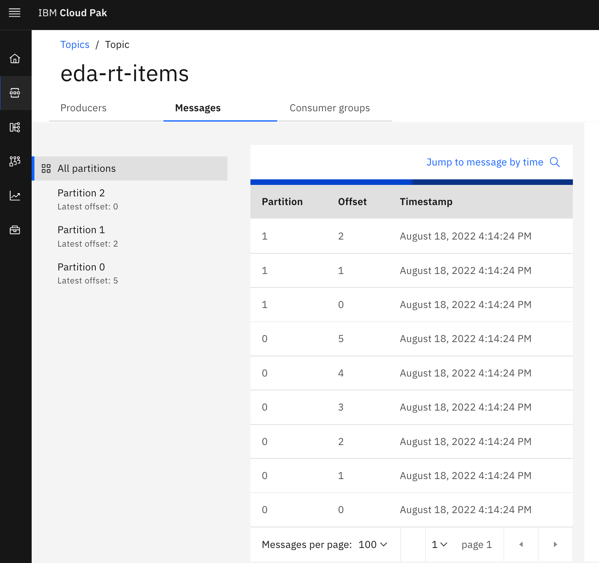

# How to demonstrate the real time inventory scenario

## Real-time inventory scenario presentation

Stores are sending their sale transactions to a central messaging platform, based on IBM MQ queues and Kafka topics.

As illustrated by the following figure, we are using Kafka / Event Streams to support the events pub/sub and 
the need to have aggregators to compute store inventory and item cross stores inventory. The following figure illustrates the expected
components deployed by this GitOps:


* The store simulator sends sell or restock messages to MQ ITEMS queue, which are picked up by Kafka MQ source connector to publish to kafka `items` topic. 
* As an alternate demo, the store simulator may send directly to Kafka to the `items` topic
* The Item-aggregator component computes items inventory cross stores, so aggregate at the `item_ID` level. 
* The Store-aggregator computes aggregates at the store level for each items.
* Sink connector can write to Cloud Object Storage buckets
* Sink connector can write to ElasticSearch

!!! Warning
    As of now, the sink connectors to ElasticSearch and COS are not configured in the standard demonstration.
## Demonstration script

### Use store simulator

1. Get the Store simulator route using the following command and start a Web Browser

    ```sh
    chrome http://$(oc get routes store-simulator  -o jsonpath="{.spec.host}")
    ```

    You should reach the Home page of the simulator - (Version number may be different)

    

    The simulator will send different sell events for the stores as listed in the Stores table. The list of stores is as of now static, and does not have any special semantic, except the store ID that will be used in the generated messages.  


1. Look at existing stores, using the top right `STORES` menu. This is just for viewing the data. No action can be done on this screen.

    

1. Go to the SIMULATOR tab, and start the controlled scenario which will send the following predefined records:

    

    Here is the ordered list of messages sent:

    | Store | Item | Action |
    | --- | --- | --- |
    | Store 1 | Item_1 | +10 |
    | Store 1 | Item_2 | +5 |
    | Store 1 | Item_3 | +15 |
    | Store 2 | Item_1 | +10 |
    | Store 3 | Item_1 | +10 |
    | Store 4 | Item_1 | +10 |
    | Store 5 | Item_1 | +10 |
    | Store 1 | Item_2 | -5 |
    | Store 1 | Item_3 | -5 |


    once started a table should be displayed to present the records sent to MQ (or Kafka).

     

### Verify MQ queue

!!!- "Info"
    The deployment of the solution has created a MQ source connector and a Kafka Connector cluster. It is possible to start and stop the MQ source connector with the following command from your laptop:

    ```sh
    # Stop the connector
    oc delete -f environments/multi-tenancy/apps/mq-source/kafka-mq-src-connector.yaml 
    # Start
    oc apply -f environments/multi-tenancy/apps/mq-source/kafka-mq-src-connector.yaml 
    ```

1. If Kafka connector is not running, you will be able to verify the messages are in MQ queue -  Access the MQ Console using the Cloud Pak for integration navigator and messaging: 

    * Go to an URL like: https://cpd-cp4i.apps.rey.coc-ibm.com/zen/#/homepage

    

    * Select Messaging on the left menu and `store-mq` instance

    

    * Go to the the Queue manager admin console and select the QM1 Queue manager 

    

    * Select the ITEMS queue to verify the messages reach the queue. It may be possible that the Kafka Connector already consumed those messages
    so the queue may look empty.

    

    Below is a view of one of those message.

    

### Verify messages in Event Streams

1. If the Kafka MQ source connector is running then the messages published to MQ are immediatly processed and sent to the `items` topic.

    

1. As the two aggregator applications are also processing the item events, you should get messages in the  `item.inventory` topic:

    

    and the `store.inventory`

    

1. You can also verify the current consumer groups subscribing to the `items` topic:

    

### Using interactive queries

1. Let assess if we can see the item stock cross stores: using the `item-aggregator` route, something like ` item-aggregator-rt-inventory.....us-east.containers.appdomain.cloud ` but completed with '/q/swagger-ui' as we want to access the API
  
    To get this route use the following command:

    ```sh
    chrome http://$(oc get routes item-inventory -o jsonpath="{.spec.host}")/q/swagger-ui
    ```

    Select the get `/api/v1/items/{itemID}` operation:

    

    Use one of the following item id: [Item_1, Item_2, Item_3, Item_4, Item_5, Item_6, Item_7]. You should get 
    the current stock cross stores

    

1. Let assess a store stock, for that we access the store aggregator URL: `store-aggregator-rt-inventory.dte-ocp46-73awfj-915b3b336cabec458a7c7ec2aa7c625f-0000.us-east.containers.appdomain.cloud ` with the `/q/swagger-ui` suffix.

    To get this route use the following command:

    ```sh
    chrome http://$(oc get routes store-aggregator -o jsonpath="{.spec.host}")/q/swagger-ui
    ```

    Then using the GET on the `api/v1/stores/inventory/{storeID}`, and enter one of the available store: `[Store_1, Store_2, Store_3, Store_4, Store_5]`

    


## Continuous message generation

Using the simulator it is possible to send n messages with random payload or send continuously by selecting one of the options:


