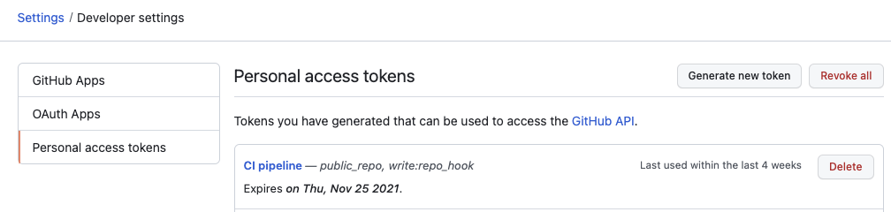
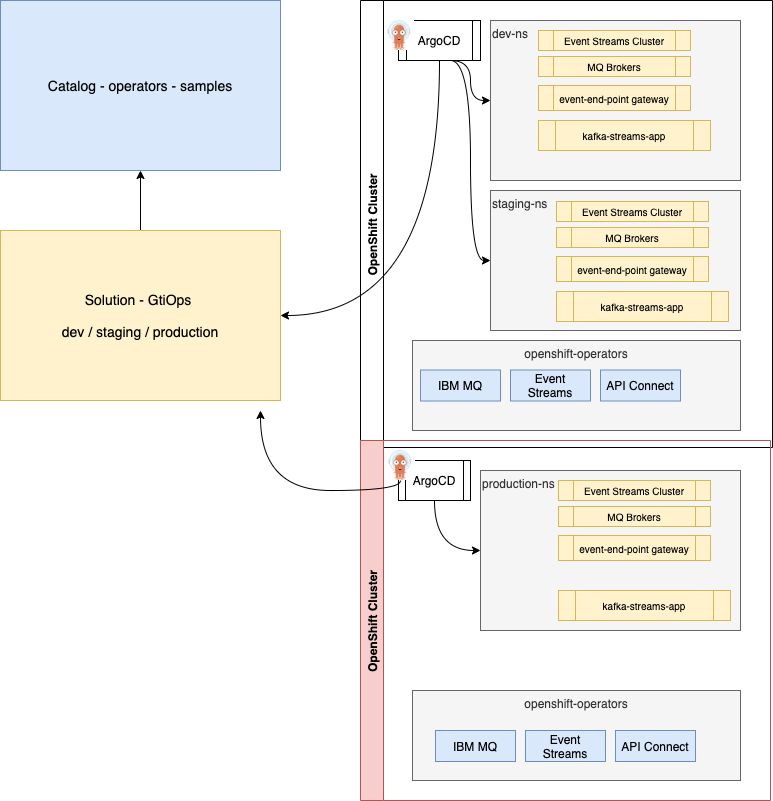
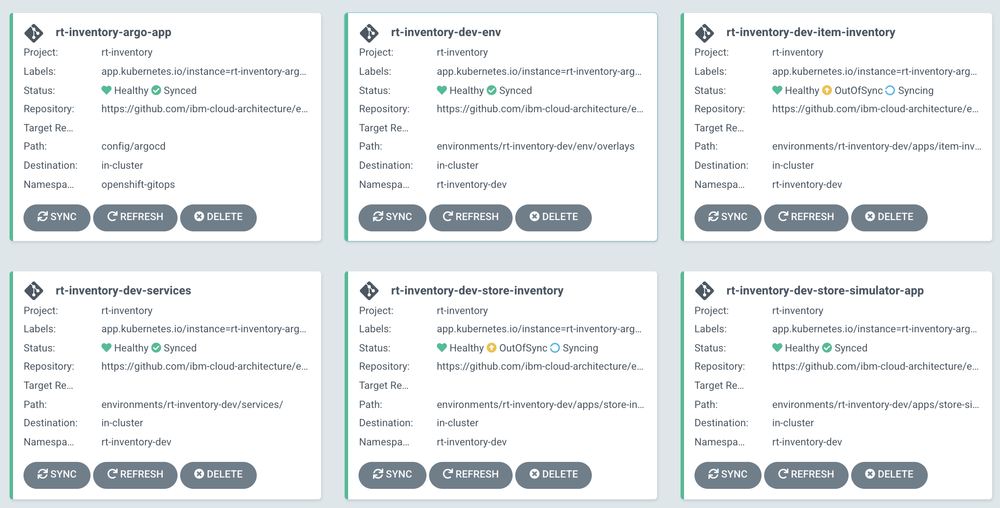
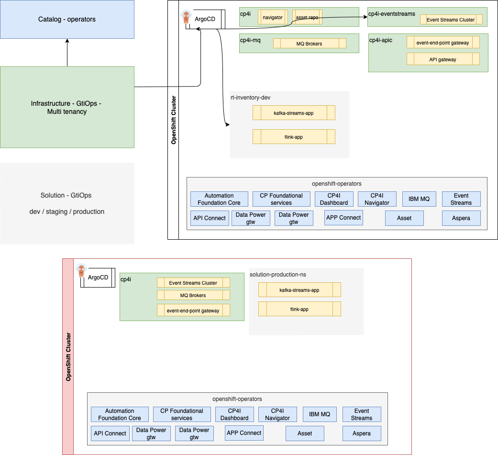

# GitOps approach

## What is covered

This GitOps supports bootstrapping the solution as a Day 1 operation, with the deployment of operators, secrets, pipelines... Then with Day 2 operations any changes to the configurations are done in this repository, manage with the Git PR process and changes are propagated by ArgoCD to the runtime cluster.

In this Gitops you can use different approaches to deploy the real-time inventory solution depending of your goals.

* You want to play with the demo, so [run it locally to your laptop using docker](#run-the-solution-locally). It uses Event Streams and MQ docker images. You can run it in different mode, depending of the sinks you want to add.
* [Start from an OpenShift Cluster without any Cloud Pak for Integration components](#gitops-from-a-new-openshift-cluster), this will take few hours to deploy as some Operator and Operand deployments may take time. 
* [Start from a Cloud Pak for integration deployed in cp4i project](#gitops-from-cp4i-deployment)
* Deploy the solution on a CMC CoC environment, which means different namespaces per product, so for example Event Streams is in `cp4i-eventstreams`. See instruction in [multi-tenant section](#gitops-for-multi-tenants).

You are not forced to use ArgoCD, you can just use the makefile and `make` CLI to deploy the solution.

## How this repository was created

We used KAM CLI to create the project with the following parameters:

Get Github access token, to be used in the KAM bootstrap command, in future steps.




```sh
kam bootstrap \
--service-repo-url https://github.com/ibm-cloud-architecture/refarch-eda-store-inventory \
--gitops-repo-url  https://github.com/ibm-cloud-architecture/eda-rt-inventory-gitops \
--image-repo image-registry.openshift-image-registry.svc:5000/ibmcase/ \
--output eda-rt-inventory-gitops \
--git-host-access-token <a-github-token> \
--prefix edademo --push-to-git=true
```

The generated content was enhanced to add boostraping configuration and scripts, the final repository structure includes:

* **Boostrap** folder: to install different operators and to define the ArgoCD project named `rt-inventory`.
* **config** folder, is for defining the ArgoCD apps and the app of apps. 
* **kconnect** folder is used to build a custom docker image of Kafka connector with MQ source, Elasticsearch sink and Cloud Object storage sink.
* **local-demo** folder is for running the solution on your laptop using docker-compose.
* **environments** folder, is the most important one, it uses [Kustomize](https://kustomize.io/) 
to declare environments (dev, staging) and component deployments (See next section for details). 

We also added a `Makefile` and scripts to deploy the gitops, pipelines operators and different elements with or without GitOps.

## GitOps on new OpenShift Cluster

The GitOps approach is using the [EDA catalog repository](https://github.com/ibm-cloud-architecture/eda-gitops-catalog) to keep product-specific operator subscriptions, where product instance definitions are part of this [real-time inventory solution GitOps](https://github.com/ibm-cloud-architecture/eda-rt-inventory-gitops) repository. This corresponds to the yellow rectangles in the figure below:



### What is deployed in this demonstration

The development project includes event-streams, MQ, schema registry... 

  

Part of this deployment will be based on commands run from your laptop, part as pipelines, and part as ArgoCD apps. The approach is based on the following:

* secrets, and operators deployments to bootstrap the CI/CD are configured with Makefile and commands. Operators are deployed in `openshift-operators`.
* Tekton pipelines are used to deploy some CP4I operators
* ArgoCD apps are used to deploy CP4I operands: the use of ArgoCD for this, is justified for Day 2 operations. 

The pipelines are using a service account, named `pipeline`, in the `rt-inventory-cicd` project, and cluster role to access different resources cross namespaces.

*For a pure demo, without any ArgoCD, other pipelines and Make commands are available to deploy operators and operands, see section [Deploy without ArgoCD apps](#deploy-without-argocd-apps)*

### CP4Integration installation considerations

* In this solution, CP4I operators are deployed in **All namespaces**, the entire OpenShift cluster effectively behaves as one large tenant.
* With **All namespace** there can be only one Platform Navigator installed per cluster, and all Cloud Pak instances are owned by that Platform Navigator. 
* A single instance of IBM Cloud Pak foundational services is installed in the `ibm-common-services` namespace if the foundational services operator is not already installed on the cluster.
* Operators can be upgraded automatically when new compatible versions are available. For production deployment, the manual upgrade may be desirable.

### Bootstrap GitOps

The current GitOps will run on OpenShift 4.8.

* Login to the OpenShift Console, and get login token to be able to use `oc cli`
* Obtain your [IBM license entitlement key](https://github.com/IBM/cloudpak-gitops/blob/main/docs/install.md#obtain-an-entitlement-key) and export as KEY environment variables

    ```sh
    export KEY=<yourentitlementkey>
    ```

* create `github-credentials.yaml` file for the git secret based on [`template-github-credentials.yaml`](./template-github-credentials.yaml). Use your github personal access token. It will be used by the pipeline runs.
* create a Secret for your IBM Cloud Object Storage credential. Use the on [`template-cos-credentials.yaml`](./template-cos-credentials.yaml) and modify the following parameters: 

  ```yaml
    cos.api.key: <cos-credential.field.apikey>
    cos.bucket.location: <region where the cos bucket is>
    cos.bucket.name: <bucketname>
    cos.service.crn: <cos-credential.field.iam_serviceid_crn>
  ```

* If not done already, use the following command to install GitOps and Pipeline operators, entitlement key, and IBM image catalog: 

  ```sh
   make prepare
  ```
    
  Once the operators are running the command: `oc get pods -n openshift-gitops` should return a list of pods like:

  ```sh
    NAME                                                          READY   STATUS    RESTARTS   AGE
    openshift-gitops-application-controller-0                     1/1     Running   0          4h5m
    openshift-gitops-applicationset-controller-6948bcf87c-jdv2x   1/1     Running   0          4h5m
    openshift-gitops-dex-server-64cbd8d7bd-76czz                  1/1     Running   0          4h5m
    openshift-gitops-redis-7867d74fb4-dssr2                       1/1     Running   0          4h5m
    openshift-gitops-repo-server-6dc777c845-gdjhr                 1/1     Running   0          4h5m
    openshift-gitops-server-7957cc47d9-cmxvw                      1/1     Running   0          4h5m
  ```

* Deploy different IBM product Operators (Event Streams, MQ...) to monitor `All Namespaces`:

  ```sh
  make install_cp4i_operators
  ```
 
  The IBM common services deployment can take more than 30 minutes.
  
* Get the ArgoCD User Interface URL and open a web browser:

   ```sh
   chrome https://$(oc get route openshift-gitops-server -o jsonpath='{.status.ingress[].host}'  -n openshift-gitops)
   ```

### Deploy ArgoCD app of apps:

* To start the Continuous Deployment with ArgoCD, just executing the following command should deploy event streams cluster instance, MQ broker, kafka connect, and the different microservices.

   ```sh
   oc apply -k config/argocd
   # Or
   make start_argocd_apps
   ```

The expected set of ArgoCD apps looks like:

  

  * **rt-inventory-Argo-app** is an app of apps
  * **rt-inventory-dev-env** is for the rt-inventory-dev namespace
  * **rt-inventory-dev-services** is for event streams, kafka connect cluster and mq deployments in dev-env namespace
  * **rt-inventory-store-simulator-app** is for the simulator app used in the demo.
  * **rt-inventory-item-inventory** for the item aggregator application
  * **rt-inventory-store-inventory** for the store aggregator application

### Potential errors

* "ConfigMap ibm-common-services-status in **kube-public** to be ready"
    
    * While the Event Streams cluster is created: An unexpected exception was encountered: Exceeded timeout of 1200000ms while waiting for ConfigMap resource **ibm-common-services-status** in namespace **kube-public** to be ready. More detail can be found in the Event Streams Operator log.
    * This is an issue known as of 10.5.  Restart the ES operator pod
    * See also https://github.ibm.com/mhub/qp-planning/issues/7383

### Configure connector

* Go to the dev project: `oc project rt-inventory-dev`
* Deploy the sink kafka connector for cloud object storage:

  * Modify the file `kafka-cos-sink-connector.yaml` in `environments/rt-inventory-dev/apps/cos-sink`, by replacing the following line from the cloud object storage credentials:

  ```yaml
    cos.api.key: IBM_COS_API_KEY
    cos.bucket.location: IBM_COS_BUCKET_LOCATION
    cos.bucket.name: IBM_COS_BUCKET_NAME
    cos.bucket.resiliency: IBM_COS_RESILIENCY
    cos.service.crn: "IBM_COS_CRM"
  ```

  * Then deploy the connector: `oc apply -f environments/rt-inventory-dev/apps/cos-sink/kafka-cos-sink-connector.yaml `

* Deploy the MQ source connector

  ```sh
  oc apply -f environments/rt-inventory-dev/apps/mq-source/kafka-mq-src-connector.json
  ```

* Access to the Simulator User Interface via:

   ```sh
   chrome http://$(oc get route store-simulator -o jsonpath='{.status.ingress[].host}')
   ```

* Access Event Stream Console:

  ```sh
  chrome https://$(oc get route dev-ibm-es-ui -o jsonpath='{.status.ingress[].host}')
  ```

* Access to IBM MQ Admin Console

  ```sh
  chrome https://$(oc get route store-mq-ibm-mq-qm -o jsonpath='{.status.ingress[].host}')
  ```


## Deploy in an existing CP4I deployment

In this section we suppose CP4I is already deployed in `cp4i` namespace, event streams in `cp4i-eventstreams` project. So somewhere someone has already deployed the infrastructure, and other components as multi tenants. (This is represented as the green rectangles in the figure below)


## Bootstrap GitOps

* Login to the OpenShift Console, and get login token to be able to use `oc cli`
* If not done already, use the script to install GitOps and Pipeline operators:

  ```sh
  make verify_argocd
  ```
    

* Create an ArgoCD project named `rt-inventory`

   ```sh
   oc apply -k bootstrap/argocd-project
   # Result
   appproject.argoproj.io/rt-inventory created
   ```

* To get the `admin` user's password use the command

    ```sh
    oc extract secret/openshift-gitops-cluster -n openshift-gitops --to=-
    ```

* Get the ArgoCD User Interface URL and open a web browser

   ```sh
   chrome https://$(oc get route openshift-gitops-server -o jsonpath='{.status.ingress[].host}'  -n openshift-gitops)
   ```

### Deploy the solution

* To start the Continuous Deployment with ArgoCD, just executing the following command should deploy different microservices under rt-inventory-dev project using event-streams, MQ.. from another project (e.g. cp4i).

   ```sh
   oc apply -k config/cp4i-deploy
   ```

## Gitops for multi-tenants

This is another interesting deployment where some of the products are shared between teams like Event Streams in `cp4i-eventstreams` project.

Here is a diagram to illustrate this multi-tenant deployment:



Some particularities:

* Event Streams is in its own project, so topics, users follow a naming convention for deployment to avoid colision with other teams / solutions
* MQ broker runs local to the solution namespace. (`rt-inventory-dev` has its own MQ Broker)


```sh
make multi-tenants
```

* Get Store Simulator URL and execute the demonstration script:

```sh
chrome $(oc get routes store-simulator -o jsonpath='{.status.ingress[].host};)
```