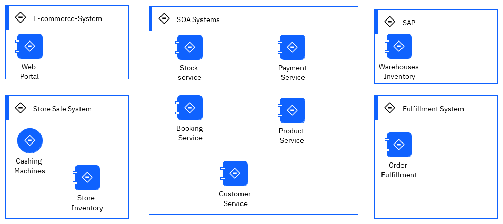

# Real-time inventory demo

This repository uses OpenShift GitOps to manage the deployment of the real-time inventory demonstration. The GitOps approach is an adaptation of [Red Hat's KAM practices](https://developers.redhat.com/articles/2021/07/21/bootstrap-gitops-red-hat-openshift-pipelines-and-kam-cli#a_gitops_approach_to_application_deployment) enhanced
to be able to boostrap some important operators like the OpenShift GitOps Operator and OpenShift Pipelines Operator and Cloud Pak for integration operators.

## Why to consider

This project can be a good foundation to discuss GitOps deployment, and reuse scripts, makefile... to deploy event-driven solution.

As a developer you will use Microprofile reactive messaging, Kafka Streams API, Quarkus and OpenLiberty. IBM MQ source Kafka connector from IBM Event messaging github, Elastic search sink connector. 

## Use Case Overview

Today, a lot of companies which are managing item / product inventory are facing real challenges to get a close to real-time view of item availability
and global inventory view. The solution can be very complex to implement while integrating Enterprise Resource Planning products and other custom legacy systems. 
Any new solutions are adopting events as a source to exchange data, to put less pressure on existing ERP servers, and to get better visibility 
into inventory positions while bringing agility to develop new solution with streaming components.

This scenario implements a simple near real-time inventory management solution based on real life MVPs we developed in 2020 for different customers. The demonstration illustrates how event streaming processing help to build inventory views.

A production deployment will implement different level of store and warehouse inventory aggregators that will push results as events to an event backbone, which in our case is IBM Event Streams.

Servers in the Store are sending sale transactions to a central messaging platform, where streaming components are computing the different aggregates. This is a classical data streaming pipeline. Sink connectors, based on Kafka Connect framework, may be used to move data to long persistence storage like object storage or a Database, to integrate results back to Legacy ERP, to use indexing product like Elastic Search, or to propagate events to dashboards.

In real life, an as-is solution will include back-end applications to manage the warehouses inventory, connected to a home-built fulfillment application, combined with store applications and servers, e-commerce suite, and a set of SOA services exposing backend systems. This is the larger view of the
following figure:

 

We may have integration flows to do data mapping, but most of those calls are synchronous.  To get item availability, a lot of SOAP calls are done, increasing latency, and the risk of failure. There is [an interesting video](https://www.youtube.com/watch?v=FskIb9SariI) from Scott Havens explaining the needs 
from transitioning from a synchronous architecture to an event-driven asynchronous architecture when scaling, and low latency are must have. 
This lab reflects this approach.

## Demonstration components

The demonstration may be used with different level of integration, and you can select those `a la carte`. The following diagram illustrates the current components:


Diagram source: [rt-inventory diagram](https://github.com/ibm-cloud-architecture/eda-rt-inventory-gitops/blob/main/docs/diagrams/mq-es-demo.drawio)

1. The [store simulator application](https://github.com/ibm-cloud-architecture/refarch-eda-store-simulator) is a Quarkus based microservice, used to generate item sales 
to different possible messaging middlewares ( RabbitMQ, IBM MQ or directly to IBM Event Streams). 
If you want to browse the code, the main readme of this project includes how to package and run the app with docker compose. A code explanation
section may give you some ideas to developers. The docker image is [quay.io/ibmcase/eda-store-simulator/](https://quay.io/ibmcase/eda-store-simulator) and can be used for demonstration.
1. The item inventory aggregator is a stateful application, done with Kafka Stream API. The source code is in [the refarch-eda-item-inventory project](https://github.com/ibm-cloud-architecture/refarch-eda-item-inventory). 
Consider this more as a black box in the context of the scenario, it consumes items events, aggregate them, expose APIs on top of Kafka Streams interactive queries and publishes inventory events on `item.inventory` topic. 
As a developer you may want to understand the Kafka Stream programming with the [following labs](https://ibm-cloud-architecture.github.io/refarch-eda/use-cases/kafka-streams/), and then considering looking at the classes: [ItemProcessingAgent.java](https://github.com/ibm-cloud-architecture/refarch-eda-item-inventory/blob/master/src/main/java/ibm/gse/eda/inventory/domain/ItemProcessingAgent.java).
1. The store inventory aggregator is a Kafka Stream application, also done with Kafka Stream API. The source code is in [the refarch-eda-store-inventory project](https://github.com/ibm-cloud-architecture/refarch-eda-store-inventory). The output is in `store.inventory` topic. 
1. The MQ to Kafka, Kafka connect cluster is defined in the [eda-rt-inventory-GitOps](https://github.com/ibm-cloud-architecture/eda-rt-inventory-gitops) repository under the [kconnect](https://github.com/ibm-cloud-architecture/eda-rt-inventory-gitops/tree/main/kconnect) folder, and the source connector in [environments/rt-inventory-dev/apps/mq-source](https://github.com/ibm-cloud-architecture/eda-rt-inventory-gitops/blob/main/environments/rt-inventory-dev/apps/mq-source)
1. The Kafka to Cloud Object Storage Kafka (S3 bucket) connector is defined in the [environments/rt-inventory-dev/apps/cos-sink folder](https://github.com/ibm-cloud-architecture/eda-rt-inventory-gitops/blob/main/environments/rt-inventory-dev/apps/cos-sink/kafka-cos-sink-connector.yaml).
1. The Sink connector to Elastic Search is defined in [environments/rt-inventory-dev/apps/elastic-sink folder](https://github.com/ibm-cloud-architecture/eda-rt-inventory-gitops/blob/main/environments/rt-inventory-dev/apps/elastic-sink/kafka-elastic-sink-connector.yaml).

[Kafka Connect](https://ibm-cloud-architecture.github.io/refarch-eda/technology/kafka-connect/) is used to integrate external systems into Kafka. For example external systems can inject item sale messages to queue, from which a first MQ source Kafka connector publishes the messages to the `items` Kafka topic. Items sold events are processed by a series of streaming microservices which publishes aggregation results to different topics.
Those topics content could be which will be used by Sink connectors to send records to other external systems.

## A GitOps approach for solution deployment

As any cloud-native and kubernetes based solution, we use continuous integration and continuous deployment practices. From a demonstration point of view, the most interesting part is
to execute continuous deployment using a [GitOps approach](/use-cases/gitops/). This GitOps repository
(represented as the yellow rectangle in figure below) defines the ArgoCD apps used 
to monitor and deploy the different microservices, streaming processing apps,
and the different IBM products needed: Event Streams, MQ, API management, event-end-point management. The figure belows presents the adopted strategy:


The [gitops catalog repository](https://github.com/ibm-cloud-architecture/eda-gitops-catalog.git), represented with a blue rectangle, defines the different operator subscriptions
for the IBM Cloud Pak for Integration components. Centralizing to one repository such operator subscriptions enforces reuse between solutions.

### Components for GitOps demo

From a Gitops point of view, the solution may deploy the following components: 


The installation approach is to deploy operators to manage All Namespaces, at the `cluster scope. So only one Platform UI can be installed per cluster. A single instance of IBM Cloud Pak foundational services is installed in the `ibm-common-services` namespace.

The following operators may be installed from this GitOps:

* name:ibm-integration-platform-navigator
* name:ibm-integration-asset-repository
* name:ibm-integration-operations-dashboard
* name:ibm-eventstreams
* name:ibm-mq

The entitlement key secret will be copied to each namespace where some of the Cloud Pak integration products are deployed, using a kubernetes job.

## Choose a runtime option


* [Run on your laptop](/#run-the-solution-locally)
* [Use GitOps on a new OpenShift Cluster](gitops/#gitops-on-new-openshift-cluster)
* [Use Gitops on existing Cloud Pak Integration (multi-tenant)](.gitops/#deploy-in-an-existing-cp4i-deployment)
* [Wihout GitOps, just yaml, on a new OpenShift Cluster](/#deploy-on-a-brand-new-openshift-cluster)
* [Wihout GitOps, just yaml, on existing Cloud Pak Integration (multi-tenant)](/#deploy-on-a-brand-new-openshift-cluster)

## A non gitops approach

### Deploy on a brand new OpenShift cluster

The makefile will support the minimum commands, depending on what is your current environment:

```sh
# If needed :prepare entitlementkey,  catalog 
make prepare
# If needed install cp4i different operators
make install_cp4i_operators
# Deploy the dev environment
make deploy_rt_inventory
```

### Deploy on multi-tenant environment


## Pre-requisites for all options

* All the CLI commands must be performed by a Cluster administrator. You need `oc cli` and the `jq` JSON stream editor installed.
* [Docker](https://docs.docker.com/) and docker compose to run the solution locally.
* [git CLI](https://git-scm.com/downloads).
* Clone this repository

```sh
git clone https://github.com/ibm-cloud-architecture/eda-rt-inventory-gitops.git
```

You need an OpenShift cluster available with storage capabilities to support Event Streams deployments like block storage configured to use the XFS or ext4 file system, as described in [Event Streams storage](https://ibm.github.io/event-streams/installing/prerequisites/#data-storage-requirements).

You need to have one volume per broker and zookeeper instances.
 
See also the [interactive Installation Guide for cloud pak for integration](https://www.ibm.com/docs/guide/viewer/public/cloud-paks/cp-integration/2021.4?interact=installing-cloud-pak-for-integration&utm_source=guide). 


## Two different streaming approaches

We propose two approaches to develop the streaming processing. 

* One using Kafka Streams with two applications
* One using Apache Flink

### Kafka Streams implementation

* The Item-aggregator, based on Kafka Stream APIs, is in this project: [refarch-eda-store-inventory](https://github.com/ibm-cloud-architecture/refarch-eda-store-inventory)
* The Store-aggregator, also based on Kafka Stream APIs, is in this project: [refarch-eda-store-inventory](https://github.com/ibm-cloud-architecture/refarch-eda-store-inventory)

### Fink implementation

See [the refarch-eda-item-inventory-sql-flink repository](https://github.com/ibm-cloud-architecture/refarch-eda-item-inventory-sql-flink) for more information.

## Run the solution locally

As a developer or technical seller you could demonstrate this scenario on your laptop. You an run MQ, EventStreams in docker too.
The docker images used in this solution are in public registry ([Quay.io](https://recovery.quay.io/organization/ibmcase)).

Under this repository the `local-demo/kstream` folder has different docker compose files to have different components running:

* [docker-compose.yaml](https://github.com/ibm-cloud-architecture/eda-rt-inventory-gitops/tree/main/local-demo/kstreams/docker-compose.yaml) for Event Streams, IBM MQ, Kafka Connector 
the Store Simulator App, the Item aggregator App, the Store aggregator App, and KafDrop to get a user interface to Kafka.
* [docker-compose-all.yaml](https://github.com/ibm-cloud-architecture/eda-rt-inventory-gitops/tree/main/local-demo/kstreams/docker-compose-all.yaml) same as above plus ElasticSearch (1 node) and Kibana

Once you have cloned the gitops repository (see pre-requisites section), go under the `local-demo/kstreams` 

* Start local kafka, with the 3 apps, MQ and ElasticSearch services run

```sh
cd local-demo/kstreams
docker-compose -f docker-compose-all.yaml up -d
```

* As an alternate to only start Kafka, MQ and the 3 apps run:

```sh
cd local-demo/kstreams
docker-compose up -d
```

* As another alternate without MQ and elastic search:

```sh
cd local-demo/kstreams
docker-compose -f docker-compose-kafka.yaml up -d
```

The demonstration script is the [same as described in this chapter](./demo-script.md), except that we use Kafdrop to visualize the content of Event Streams topics. 

Use the simulator the console is: [http://localhost:8080/#/](http://localhost:8080/).

If you run the controlled scenario the data are:

| Store | Item | Action |
| --- | --- | --- |
| Store 1 | Item_1 | +10 |
| Store 1 | Item_2 | +5 |
| Store 1 | Item_3 | +15 |
| Store 2 | Item_1 | +10 |
| Store 3 | Item_1 | +10 |
| Store 4 | Item_1 | +10 |
| Store 5 | Item_1 | +10 |
| Store 1 | Item_2 | -5 |
| Store 1 | Item_3 | -5 |
       
Inventory should be at the store level: `{"stock":{"Item_3":10,"Item_2":0,"Item_1":10},"storeName":"Store_1"}` and at the item level:

| Item | Stock |
| --- | --- |
| Item_1 | 50 |
| Item_2 | 0 |
| Item_3 | 10 |


The store inventory API is at [http://localhost:8082](http://localhost:8082/q/swagger-ui)

The item inventory API is at [http://localhost:8081](http://localhost:8081/q/swagger-ui)

Kafdrop UI to see messages in `items`, `store.inventory` and `item.inventory` topics is at [http://localhost:9000](http://localhost:9000)

* Verify Events are in `items` topic using Kafdrop:

  

* Verify item inventory events are in `item-inventory`

  

* Finally verify item inventory events are in `store-inventory`

  

* If using ElasticSearch go to Kibana UI at [localhost:5601](http://localhost:5601)

* Stop the demo: select one of the following command:

```sh
docker-compose -f docker-compose-all.yaml down
# OR
docker-compose  down
# OR
docker-compose -f docker-compose-kafka.yaml down
```

