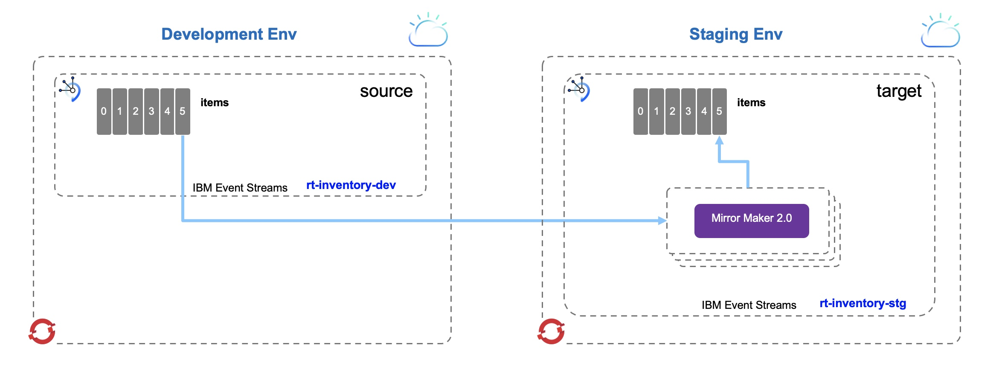
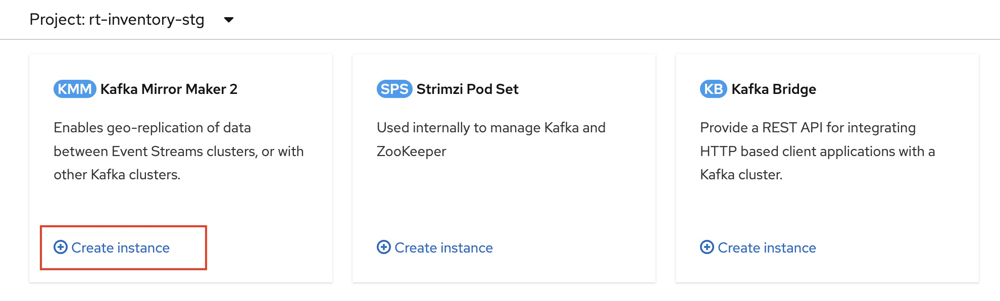
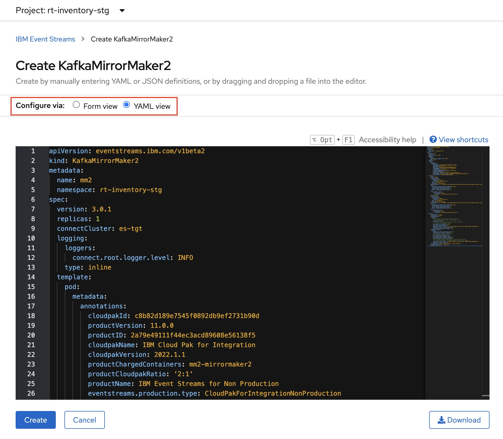
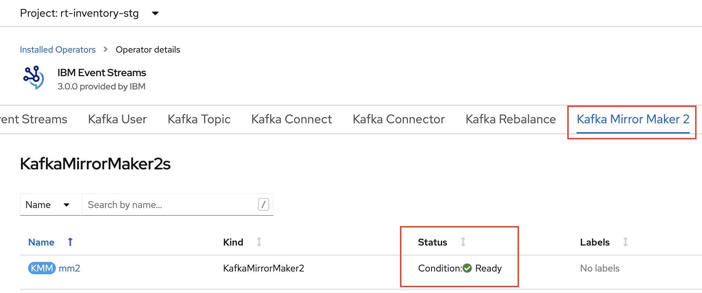
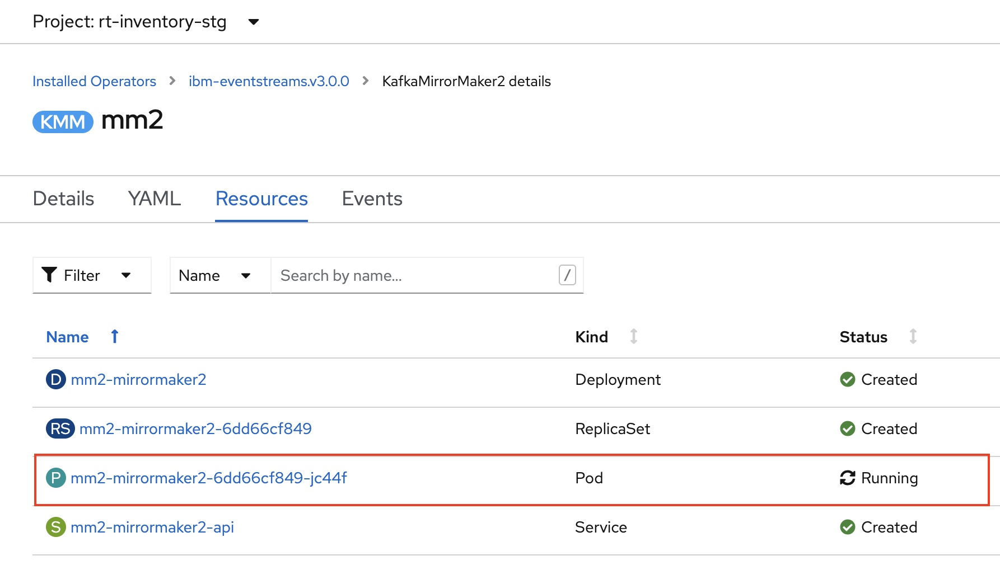
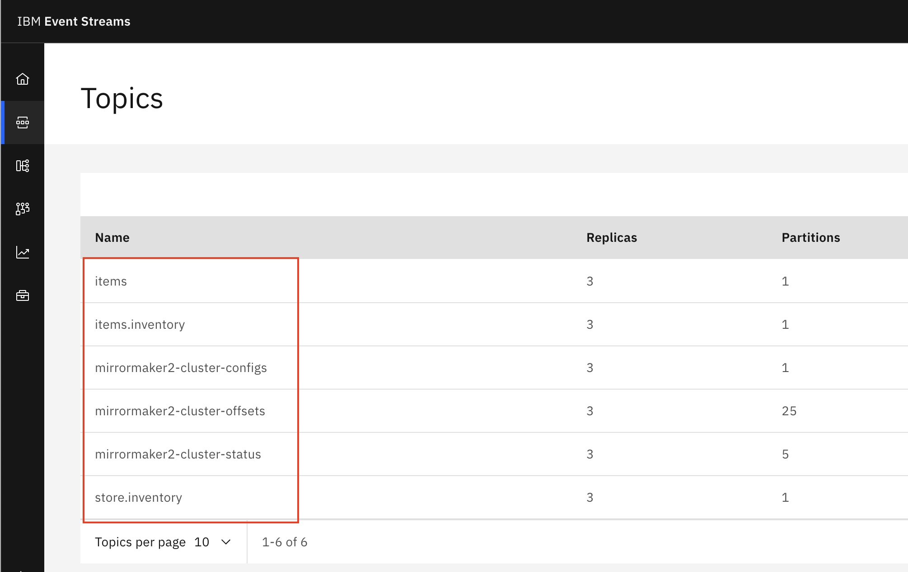
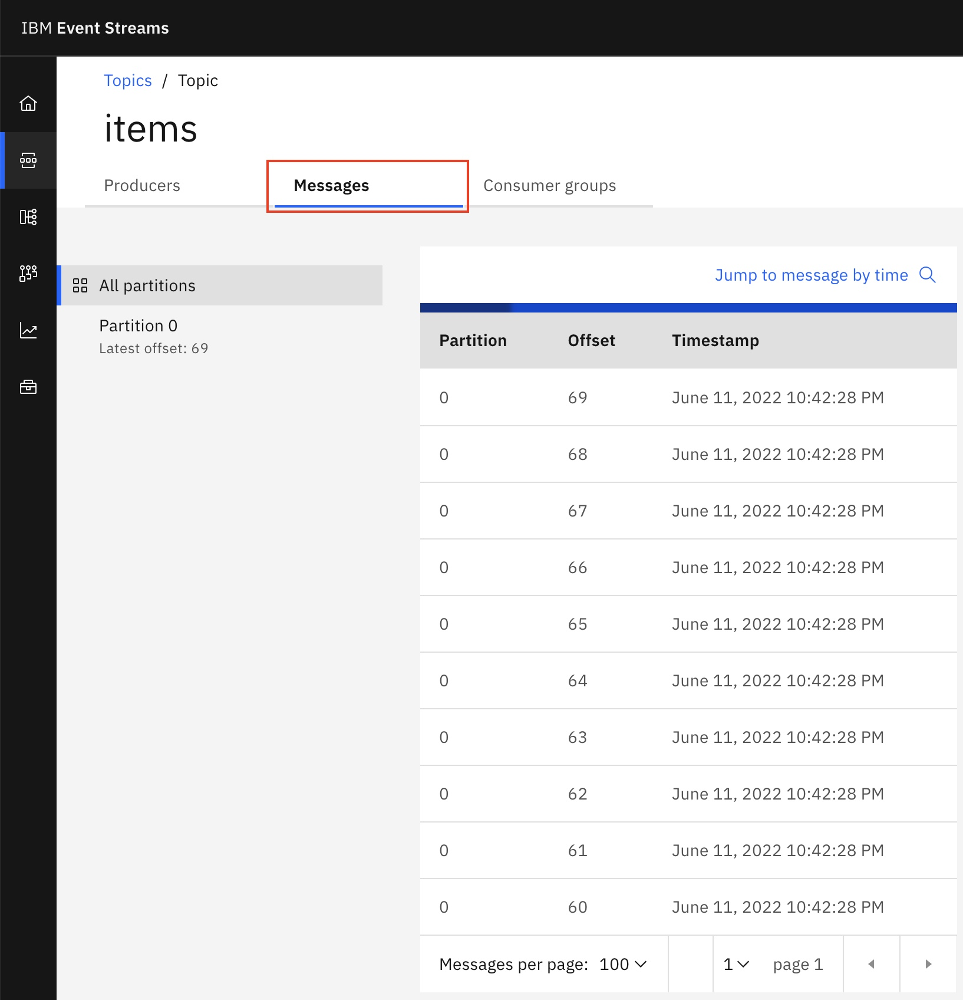
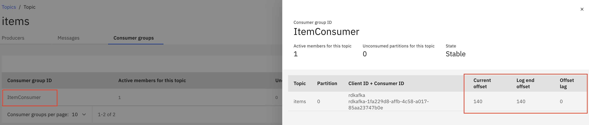

# Mirror Maker 2

## Active/Passive Mirroring

### Overview

This demo presents how to leverage Mirror Maker 2 between two Kafka clusters running on OpenShift. It uses two IBM Event Streams instances on both sides and utilizes mirroring feature that ships as part of IBM Event Streams Operator API's.

* Cluster 1 (Active): This will be our source cluster (Source). In this case it can be a Development environment where consumers and producers are connected.
* Cluster 2 (Passive): This will be our target cluster (Target). In this case it can be a Staging environment where no consumers or producers are connected.
  
Upon failover, consumers will be connected to the newly promoted cluster (Cluster 2) which will become active.

Mirror Maker 2 is a continuous background mirroring process and can be run in its own namespace. However, for the purposes of this demo, it will be created within the destination namespace, in our case `rt-inventory-stg` and connect to the source Kafka cluser, in our case it is in `rt-inventory-dev` namespace.



### Pre-requisites

- We assume, you have access to one or two separate OpenShift clusters.
- The OpenShift cluster(s) has/have IBM Event Streams Operator version 3.0.x installed and available for all namespaces on the cluster(s).

### Steps

1- Creating Source (Origin) Kafka Cluster:

- Using Web Console on the first OpenShift cluster, create a new project named `rt-inventory-dev`
- Make sure that this project is selected and create a new EventStreams instance named `rt-inventory-dev` inside it.

!!! note

        This cluster represents the Development Environment (Active)
- Once the EventStreams instance `rt-inventory-dev` is up and running, access its Admin UI to perform the below sub-tasks:

    - Create SCRAM credentials with username `rt-inv-dev-user`. This will create `rt-inv-dev-user` secret.
    - Take a note of the SCRAM username and password.
    - Take a note of the bootstrap Server address.
    - Generate TLS certificates. This will create `rt-inventory-dev-cluster-ca-cert` secret.
    - Download and save the PEM certificate. You could rename it to `es-src-cert.pem`.
    - Create Kafka topics `items`, `items.inventory`, and `store.inventory` which will be used to demonstrate replication from source to target.

!!! note

        The above two created secrets will need to be copied to the target cluster so Mirror Maker 2 can reference them to connect to the source cluster

2- Creating Target (Destination) Kafka Cluster:

- Using Web Console on the first OpenShift cluster, create a new project named `rt-inventory-stg`
- Make sure that this project is selected and create a new EventStreams instance named `rt-inventory-stg` inside it.

!!! note

        This cluster represents the Staging Environment (Passive)
- Once the EventStreams instance `rt-inventory-stg` is up and running, access its Admin UI to perform the below sub-tasks:

    - Create SCRAM credentials with username `rt-inv-stg-user`. This will create `rt-inv-stg-user` secret.
    - Take a note of the SCRAM username and password.
    - Take a note of the bootstrap Server address.
    - Generate TLS certificates. This will create `rt-inventory-stg-cluster-ca-cert` secret.
    - Download and save the PEM certificate. You could rename it to `es-tgt-cert.pem`.

!!! note

        Mirror Maker 2 will reference the above two created secrets to connect to the target cluster

3- Creating MirrorMaker 2 instance:

- Make sure that `rt-inventory-stg` project is selected.
- Create the two sercets generated from Step 1 by copying their yaml configs from `rt-inventory-dev` project to preserve the names.
- Using OpenShift Web Console (Administrator perspective), navigate to Operators -> Installed Operators.
- On the Installed Operators page, click on `IBM Event Sreams`.
- On the Avialable API's page, find `Kafka Mirror Maker 2` then click `Create instance`.



- Select Configure via YAML view to use the [yaml file](https://github.com/ibm-cloud-architecture/eda-rt-inventory-gitops/blob/main/environments/rt-inventory-stage/services/mm2/mm2-config.yaml) provided in this demo.



- Change the `bootstrapServers` address (line 36) to be the address of your Source Kafka bootstrapServer (from Step 1).
- Change the `bootstrapServers` address (line 53) to be the address of your Target Kafka bootstrapServer (from Step 2).

``` yaml linenums="1" hl_lines="36 53"
apiVersion: eventstreams.ibm.com/v1beta2
kind: KafkaMirrorMaker2
metadata:
  name: mm2
  namespace: rt-inventory-stg  
spec:
  version: 3.0.1
  replicas: 1
  connectCluster: es-tgt
  logging:
    loggers:
      connect.root.logger.level: INFO
    type: inline
  template:
    pod:
      metadata:
        annotations:
          cloudpakId: c8b82d189e7545f0892db9ef2731b90d
          productVersion: 11.0.0
          productID: 2a79e49111f44ec3acd89608e56138f5
          cloudpakName: IBM Cloud Pak for Integration
          cloudpakVersion: 2022.1.1
          productChargedContainers: mm2-mirrormaker2
          productCloudpakRatio: '2:1'
          productName: IBM Event Streams for Non Production
          eventstreams.production.type: CloudPakForIntegrationNonProduction
          productMetric: VIRTUAL_PROCESSOR_CORE
  clusters:
    - alias: es-src
      authentication:
        passwordSecret:
          password: password
          secretName: rt-inv-dev-user
        type: scram-sha-512
        username: rt-inv-dev-user
      bootstrapServers: rt-inventory-dev-kafka-bootstrap-rt-inventory-dev.itzroks-4b4a.us-south.containers.appdomain.cloud:443
      config:
        ssl.endpoint.identification.algorithm: https      
        config.storage.replication.factor: 1
        offset.storage.replication.factor: 1
        status.storage.replication.factor: 1
      tls:
        trustedCertificates:
          - certificate: ca.crt
            secretName: rt-inventory-dev-cluster-ca-cert
    - alias: es-tgt
      authentication:
        passwordSecret:
          password: password
          secretName: rt-inv-stg-user
        type: scram-sha-512
        username: rt-inv-stg-user
      bootstrapServers: rt-inventory-stg-kafka-bootstrap-rt-inventory-stg.itzroks-4b4b.us-south.containers.appdomain.cloud:443
      config:
        ssl.endpoint.identification.algorithm: https      
        config.storage.replication.factor: 3
        offset.storage.replication.factor: 3
        status.storage.replication.factor: 3    
      tls:
        trustedCertificates:
          - certificate: ca.crt
            secretName: rt-inventory-stg-cluster-ca-cert
  mirrors:
    - sourceCluster: es-src
      targetCluster: es-tgt 
      sourceConnector:
        config:
          # the replication factor that will be used for
          #  all topics created on the "target" Kafka cluster
          replication.factor: 3
          # don't try to copy permissions across from the "origin"
          #  cluster to the "target" cluster
          sync.topic.acls.enabled: "false"          
          replication.policy.separator: ""
          replication.policy.class: "io.strimzi.kafka.connect.mirror.IdentityReplicationPolicy"
          offset-syncs.topic.replication.factor: 3
          refresh.topics.interval.seconds : 10
      checkpointConnector:
        config:
          checkpoints.topic.replication.factor: 3
          refresh.groups.interval.seconds: 5
          # migrates the consumer group offsets
          emit.checkpoints.enabled: true
          sync.group.offsets.enabled: true
          sync.group.offsets.interval.seconds: 5
          emit.checkpoints.interval.seconds: 5
          # ensures that consumer group offsets on the "target" cluster
          #  are correctly mapped to consumer groups on the "origin" cluster
          replication.policy.class: "io.strimzi.kafka.connect.mirror.IdentityReplicationPolicy"
          replication.policy.separator: ""          
      topicsPattern: "items, store.inventory, items.inventory"
      topicsExcludePattern: ".apicurio"
      groupsPattern: ".*" 
```

- If the same namespaces and SCRAM usernames are used as indicated in the previous steps, no further changes are required.
- Click `Create` to apply the YAML changes and create `KafkaMirrorMaker2` instance.
- In few seconds, check the status of `KafkaMirrorMaker2` instance from Kafka Mirror Maker 2 Tab.
- The status should be `Condition: Ready`.



- `KafkaMirrorMaker2` instance created `mm2` will deploy different resources that can be checked from its `Resources` Tab.
- You might need to check the created `Pod` resource log for errors or warnings.



- Now, the created instance `mm2` will start to mirror (replicate) the Kafka topics' events, and offsets from source to the target cluster.
- Only Kafka topics specified in `topicsPattern` will be replicated and topics specified in `topicsExcludePattern` will be excluded.

### Verification

- Access the EventStreams instance `rt-inventory-stg` Admin UI to verify that the replication is working.
- From the side menu, select Topics to see the list of Kafka topics created on our Target cluster (Staging Environment).



- You can see that `items`, `items.inventory`, and `store.inventory` Kafka topics were created and events are being replicated.
- Kafka Topics named `mirrormaker2-cluster-xxx` are used internally by our `KafkaMirrorMaker2` instance to keep track of configs, offsets, and replication status.
- Click on `items` topic then visit the Messages Tab to see that the events are being replicated as they arrive to the Source cluster. The next section will demonstrate how to produce sample events to the Source cluster.



### Producing Events (Source)

This section will be used to verify that the replication of messages (Kafka events) is actually happening (live events feed is moving from Source to Target). We will use a simple python script (accompanied with a starter bash script) that connects to the Source cluster and sends a random json payloads to the `items` topic created in Step 1.

The producer script requires Python 3.x with `confluent-kafka` Kakfa library installed. To install the Kafka library, run:

``` shell
pip install confluent-kafka
```

Perform the following steps to setup the producer sample application:

1. On your local machine, create a new directory named `producer`.
2. Download and save [`SendItems.py`](https://github.com/ibm-cloud-architecture/eda-rt-inventory-gitops/blob/main/demo/mm2/scripts/SendItems.py) and [`sendItems.sh`](https://github.com/ibm-cloud-architecture/eda-rt-inventory-gitops/blob/main/demo/mm2/scripts/sendItems.sh) files inside `producer` directory.
3. Move the Source cluster PEM certificate file `es-src-cert.pem` to the same directory.
4. Edit the `sendItems.sh` script to set the environment variables of Source cluster connectivity configs.
    * Change the `KAFKA_BROKERS` variable to the Source cluster bootstrap address.
    * Change the `KAFKA_PWD` variable to be the password of `rt-inv-dev-user` SCRAM user.

``` shell
#!/bin/bash

export KAFKA_BROKERS=rt-inventory-dev-kafka-bootstrap-rt-inventory-dev.itzroks-4b4a.us-south.containers.appdomain.cloud:443
export KAFKA_USER=rt-inv-dev-user
export KAFKA_PWD=SCRAM-PASSWORD
export KAFKA_CERT=es-src-cert.pem
export KAFKA_SECURITY_PROTOCOL=SASL_SSL
export KAFKA_SASL_MECHANISM=SCRAM-SHA-512
export SOURCE_TOPIC=items

python SendItems.py $1
```
5. Now you can run the shell script and pass the number of events to be sent as an argument.

``` shell
./sendItems.sh 10
```


### Consuming Events (Target)

This section will simulate failover to Target (passive) cluster. MirrorMaker 2 uses `checkpointConnector` to automatically store consumer group offset checkpoints for consumer groups on the Source Kafka cluster. Each checkpoint maps the last committed offset for each consumer group in the Source cluster to the equivalent offset in the Target cluster.

These checkpoints will be used by our Kafka consumer script to start consuming from an offset on the Target cluster that is equivalent to the last committed offset on the Source cluster.

The same way we used to setup the Producer application, we need to perform the following steps to setup the Consumer application:

1. On your local machine, create a new directory named `consumer`.
2. Download and save [`ReceiveItems.py`](https://github.com/ibm-cloud-architecture/eda-rt-inventory-gitops/blob/main/demo/mm2/scripts/ReceiveItems.py) and [`receiveItems.sh`](https://github.com/ibm-cloud-architecture/eda-rt-inventory-gitops/blob/main/demo/mm2/scripts/receiveItems.sh) files inside `consumer` directory.
3. Move the Target cluster PEM certificate file `es-tgt-cert.pem` to the same directory.
4. Edit the `receiveItems.sh` script to set the environment variables of Target cluster connectivity configs.
    * Change the `KAFKA_BROKERS` variable to the Target cluster bootstrap address.
    * Change the `KAFKA_PWD` variable to be the password of `rt-inv-stg-user` SCRAM user.

``` shell
#!/bin/bash

export KAFKA_BROKERS=rt-inventory-stg-kafka-bootstrap-rt-inventory-stg.itzroks-4b4b.us-south.containers.appdomain.cloud:443
export KAFKA_USER=rt-inv-stg-user
export KAFKA_PWD=SCRAM-PASSWORD
export KAFKA_CERT=es-tgt-cert.pem
export KAFKA_SECURITY_PROTOCOL=SASL_SSL
export KAFKA_SASL_MECHANISM=SCRAM-SHA-512
export SOURCE_TOPIC=items

python ReceiveItems.py $1
```
5. Now you can run the shell script and pass the number of events to be consumed as an argument.

``` shell
./consumeItems.sh 10
```
6. You should see the mirrored messages now in `items` replicated topic in our Target Kafka cluster.

!!! note

        To check the current and offset lag, you can use Event Streams UI on Target cluster.
   


We can see that the consumer application has started to read from the last committed offset.

This concludes our Kafka Mirror Maker 2 Active/Passive mode replication demo.