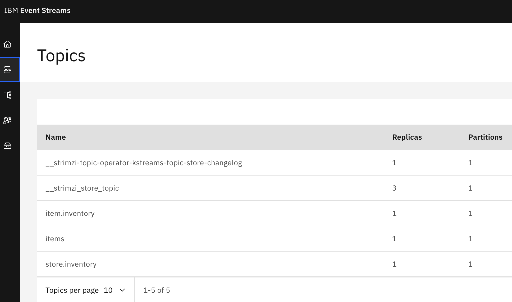
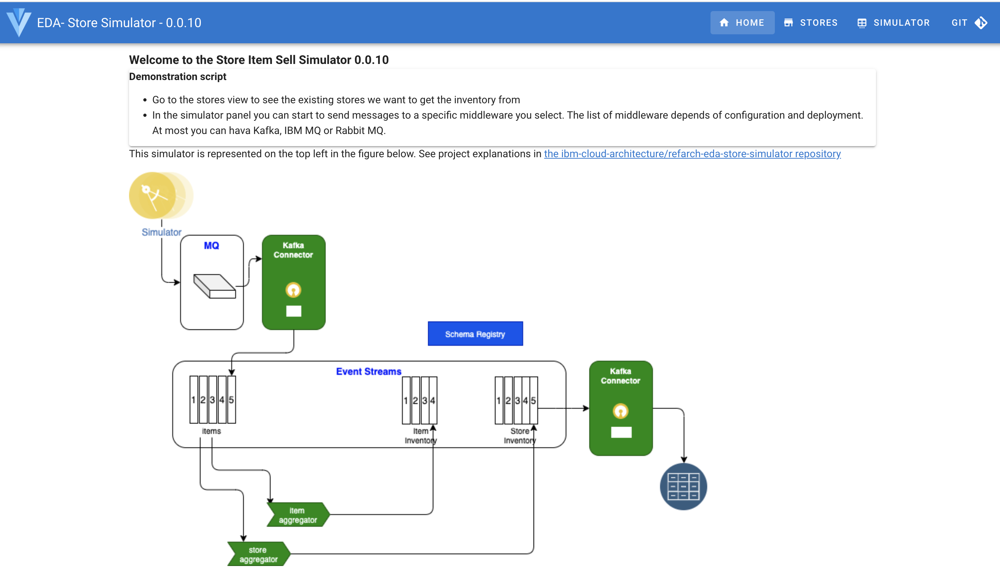
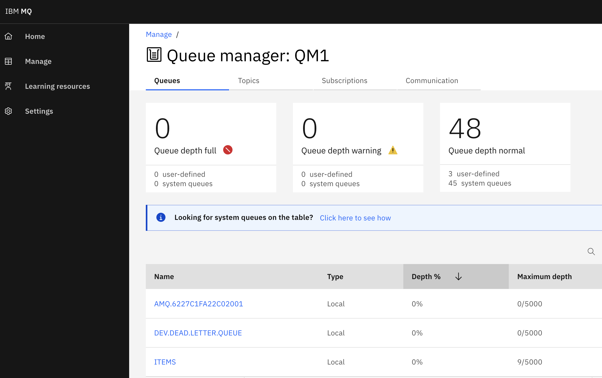
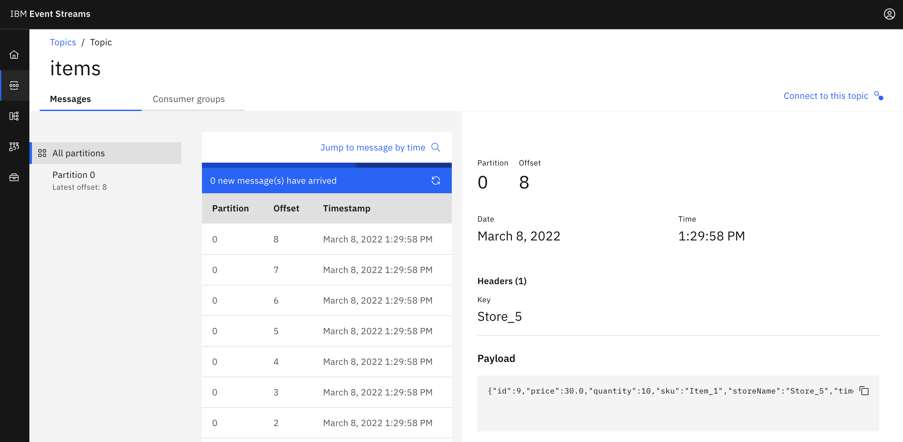

# A manual deployment of the operators, components and services


* Login to the Openshift Console
* Create a project for the solution name it rt-inventory-lab

    ```sh
    oc new-project rt-inventory-lab
    ```
* Deploy the IBM product catalog

    ```sh
    ./bootstrap/scripts/installIBMCatalog.sh
    ```
* Obtain your [IBM license entitlement key](https://github.com/IBM/cloudpak-gitops/blob/main/docs/install.md#obtain-an-entitlement-key)
* Update the [OCP global pull secret of the `openshift-operators` project](https://github.com/IBM/cloudpak-gitops/blob/main/docs/install.md#update-the-ocp-global-pull-secret)
with the entitlement key

    ```sh
    export KEY=<yourentitlementkey>
    oc create secret docker-registry ibm-entitlement-key \
    --docker-username=cp \
    --docker-server=cp.icr.io \
    --namespace=openshift-operators \
    --docker-password=$KEY 
    ```

* Deploy Event Streams, IBM MQ and API Connect Operators

    ```sh
    ./bootstrap/scripts/installIBMOperators.sh
    ```

* Copy IBM Entitlement secrets to the demo project

    ```sh
    ./bootstrap/scripts/copySecrets.sh ibm-entitlement-key  openshift-operators  rt-inventory-lab
    ```

* Create an Event Stream Cluster

    ```sh
    oc apply -k ./ocp-demo-step-by-step/ibm-eventstreams/overlays
    ```

    * Verify the Event Streams brokers are up and running

    ```sh
    oc get eventstreams
    # Results
    NAME   STATUS
    lab    Ready
    # then
    oc get pods
    # results
    lab-entity-operator-75698b5456-hm4fb   3/3     Running   0          41m
    lab-ibm-es-ac-reg-6cb8bdf949-2zjs9     2/2     Running   0          40m
    lab-ibm-es-admapi-864688969d-29xw2     1/1     Running   0          40m
    lab-ibm-es-metrics-66c495586b-qv2f4    1/1     Running   0          40m
    lab-ibm-es-recapi-797c664bf8-cr9pn     1/1     Running   0          40m
    lab-ibm-es-ui-7595ffd64d-6pnjc         2/2     Running   0          38m
    lab-kafka-0                            1/1     Running   0          42m
    lab-kafka-1                            1/1     Running   0          42m
    lab-kafka-2                            1/1     Running   0          42m
    lab-zookeeper-0                        1/1     Running   0          42m
    lab-zookeeper-1                        1/1     Running   0          42m
    lab-zookeeper-2                        1/1     Running   0          42m
    ```

    * Access to the Event Streams Console

    ```sh
     chrome https://$(oc get route lab-ibm-es-ui  -o jsonpath='{.status.ingress[].host}')
    ```

     Use OpenShift authentication option.

    * Verify the Topics were created

    ```sh
    oc get kafkatopics
    ```

    Or using the EventStreams Console

    

* Get the cluster admin password

```sh
 oc get secret platform-auth-idp-credentials -o jsonpath='{.data.admin_password}' -n ibm-common-services | base64 --decode && echo ""
```

* Deploy MQ Broker

    ```sh
    oc apply -k ./ocp-demo-step-by-step/ibm-mq/overlays
    ```

    * Verify MQ 
    
    ```sh
    oc get QueueManager
    NAME       PHASE
    store-mq   Running
    ```

    * Access MQ Console, use the admin and password previously retrieved.

    ```sh
    chrome https://$(oc get route store-mq-ibm-mq-web  -o jsonpath='{.status.ingress[].host}')
    ```

* Deploy the Store simulator demo

    ```sh
        oc apply -k ./ocp-demo-step-by-step/store-simulator
    ```

    * Open the UI

        ```sh
         chrome https://$(oc get route store-simulator  -o jsonpath='{.status.ingress[].host}')/#/
        ```

    

* Start the controlled simulator, by selecting IBMMQ and the runner icon:

     

* Verify messages are in MQ Queue named `items`

    

    and in the items queue you should see 9 messages

    

* Now we will add the Kafka connectors - MQ source connector to get those messages to the `items` topics in Event Streams

    * Deploy Kafka Connector cluster

    ```sh
    oc apply -f ocp-demo-step-by-step/kconnect/kafka-connect.yaml   
    # Verify
    oc get kafkaconnect  
    # Results
    NAME                   DESIRED REPLICAS   READY
    lab-kconnect-cluster   1                  
    ```

    * Deploy and start the MQ Source connector

    ```sh
    oc apply -f ocp-demo-step-by-step/kconnect/kafka-mq-src-connector.yaml 
    # Verify
    oc get kafkaconnectors
    # Results
    NAME        CLUSTER                CONNECTOR CLASS                                           MAX TASKS   READY
    mq-source   lab-kconnect-cluster   com.ibm.eventstreams.connect.mqsource.MQSourceConnector   1       
    ``` 

* Now items are in the topics

    

* Deploy one of the streaming agent

    ```sh
    oc apply -k ocp-demo-step-by-step/item-inventory
    # Verify
    oc get deployment item-inventory
    NAME             READY   UP-TO-DATE   AVAILABLE   AGE
    item-inventory   1/1     1            1           58s
    ```

* Deploy the Elastic Search Operator

    ```sh
    oc apply -k bootstrap/elastic-operator 
    ```

* Create an Elastic Search Cluster.  It may take up to a few minutes until all the resources are created and the cluster is ready for use.


    ```sh
    oc apply -f ocp-demo-step-by-step/elasticsearch/elasticsearch.yaml
    # Verify
    oc get elasticsearch
    # Results
    NAME            HEALTH   NODES   VERSION   PHASE   AGE
    elasticsearch   green    3       8.0.0     Ready   7m52s
    ```

    * You can do more verification, by opening a terminal on one of the elasticsearch pod and do

    ```sh
    PASSWORD=$(oc get secret elasticsearch-es-elastic-user -o go-template='{{.data.elastic | base64decode}}')
    curl -u "elastic:$PASSWORD" -k "https://elasticsearch-es-http:9200"
    # Result a json like:
    {
    "name" : "elasticsearch-es-default-1",
    "cluster_name" : "elasticsearch",
    "cluster_uuid" : "aIBcm7unT7S4hlep7_Zs2Q",
    "version" : {
        "number" : "8.0.0",
        "build_flavor" : "default",
        "build_type" : "docker",
        "build_hash" : "1b6a7ece17463df5ff54a3e1302d825889aa1161",
        "build_date" : "2022-02-03T16:47:57.507843096Z",
        "build_snapshot" : false,
        "lucene_version" : "9.0.0",
        "minimum_wire_compatibility_version" : "7.17.0",
        "minimum_index_compatibility_version" : "7.0.0"
    },
    "tagline" : "You Know, for Search"
    }
    ```

* Deploy Kibana

    ```sh
    oc apply -f ocp-demo-step-by-step/kibana/kibana.yaml
    # Verify
    oc get kibana
    NAME     HEALTH   NODES   VERSION   AGE
    kibana   green    1       8.0.0     24m
    ```

    * Verify the service and do a port forwarding to access Kibana webapp locally

    ```sh
    oc get svc kibana-kb-http
    kubectl port-forward service/kibana-kb-http 5601
    chrome https://localhost:5601
    # user is elastic, password is given by
    oc get secret elasticsearch-es-elastic-user -o=jsonpath='{.data.elastic}' | base64 --decode; echo
    ```

* Deploy Kafka connector [ElasticSearch sink connector](https://github.com/ibm-messaging/kafka-connect-elastic-sink)

    ```sh
    oc apply -f ocp-demo-step-by-step/kconnect/kafka-elastic-sink-connector.yaml
    # Verify
    oc get pods | grep kconnect
    PDNAME=$(lab-kconnect-cluster-connect-6d4d7d956f-fjjss |  awk '{print $1}')
    oc exec -ti $PODNAME -- bash -c "curl http://localhost:8083/connectors"
    # Results
    ["mq-source","elastic-sink"]
    # Or
    oc get kafkaconnectors
    # Results
    NAME           CLUSTER                CONNECTOR CLASS                                                 MAX TASKS   READY
    elastic-sink   lab-kconnect-cluster   com.ibm.eventstreams.connect.elasticsink.ElasticSinkConnector   1           True
    mq-source      lab-kconnect-cluster   com.ibm.eventstreams.connect.mqsource.MQSourceConnector         1           True
    ```

* Verify records from `item.inventory` topic are in ElasticSearch indices.


## Remove everything

```
oc delete -k ocp-demo-step-by-step/item-inventory 
oc delete -k ocp-demo-step-by-step/store-simulator
oc delete -f ocp-demo-step-by-step/kibana/kibana.yaml
oc delete -f ocp-demo-step-by-step/elasticsearch/elasticsearch.yaml
oc delete -f ocp-demo-step-by-step/kconnect/kafka-connect.yaml
oc delete -k ocp-demo-step-by-step/ibm-eventstreams/overlays
oc delete -k ocp-demo-step-by-step/ibm-mq/overlays 
```